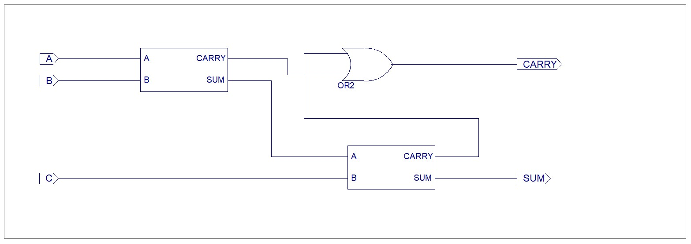
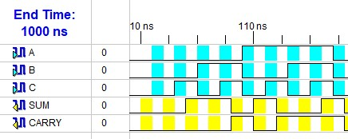

# FlipFlop
Computer Architecture assignments and lab work completed as part of my undergraduate coursework at Sister Nivedita University. 

---

## Experiments
|Sl. No.| Experiment                          | Link|
|:-     | :-:                                 | :-: |
| 1.    | Half and Full Adders                | [Link](#1-half-and-full-adders)   | 
| 2.    | Half and Full Subtractors           | [Link](#2-half-and-full-subtractors)    |
| 3.    | Full Adder using Half Adders        | [Link](#3-full-adder-using-half-adder)    |
| 4.    | Universal Gates                     | [Link](#4-universal-gates)    |

### 1. Half and Full Adders
Create a Xilinx project and create and test a half adder and a full adder. Use VHDL Modules.

The Xilinx project can be found [here](/Projects/simpleAdders).

#### Half Adder
A half adder is a logic circuit that adds two single-bit binary inputs (A and B). It produces two outputs: a Sum bit and a Carry bit.

| A | B | SUM | CARRY |
|:-:|:-:| :-: |  :-:  |
| 0 | 0 |  0  |   0   |
| 0 | 1 |  1  |   0   |
| 1 | 0 |  1  |   0   |
| 1 | 1 |  0  |   1   |

```math
\text{Sum} = A \oplus B\
```

```math
\text{Carry} = A \cdot B
```

#### VHDL Module
```vhdl
library IEEE;
use IEEE.STD_LOGIC_1164.ALL;
use IEEE.STD_LOGIC_ARITH.ALL;
use IEEE.STD_LOGIC_UNSIGNED.ALL;

entity halfAdder is
    Port ( A, B : in  STD_LOGIC;
           SUM : out  STD_LOGIC;
           CARRY : out  STD_LOGIC);
end halfAdder;

architecture Behavioral of halfAdder is
begin
	SUM <= A XOR B;
	CARRY <= A AND B;
end Behavioral;
```
####  RTL Circuit


####  Test Bench Output


#### Full Adder
A full adder is a logic circuit that adds 3 single-bit binary inputs (A, B, and C). It produces two outputs: a Sum bit and a Carry bit.

| A | B | C | SUM | CARRY |
|:-:|:-:|:-:| :-: |  :-:  |
| 0 | 0 | 0 |  0  |   0   |
| 0 | 0 | 1 |  1  |   0   |
| 0 | 1 | 0 |  1  |   0   |
| 0 | 1 | 1 |  0  |   1   |
| 1 | 0 | 0 |  1  |   0   |
| 1 | 0 | 1 |  0  |   1   |
| 1 | 1 | 0 |  0  |   1   |
| 1 | 1 | 1 |  1  |   1   |

```math
\text{Sum} = A \oplus B \oplus C
```

```math
\text{Carry} = (A \cdot B) + (B \cdot C) + (A \cdot C)
```

#### VHDL Module
```vhdl
library IEEE;
use IEEE.STD_LOGIC_1164.ALL;
use IEEE.STD_LOGIC_ARITH.ALL;
use IEEE.STD_LOGIC_UNSIGNED.ALL;

entity fullAdder is
    Port ( A, B, C : in  STD_LOGIC;
           SUM : out  STD_LOGIC;
           CARRY : out  STD_LOGIC);
end fullAdder;

architecture Behavioral of fullAdder is
begin
	SUM <= A XOR B XOR C;
	CARRY <= (A AND B) OR (B AND C) OR (A AND C); 
end Behavioral;
```
####  RTL Circuit


####  Test Bench Output


### 2. Half and Full Subtractors
Create a Xilinx project and create and test a half subtractor and a full subtractor. Use VHDL Modules.

The Xilinx project can be found [here](/Projects/simpleSubtractors).

#### Half Subtractor
A half subtractor is a logic circuit that subtracts two single-bit binary inputs (A and B). It produces two outputs: a Difference bit and a Borrow bit.

| A | B | DIFF | BORR  |
|:-:|:-:| :-:  |  :-:  |
| 0 | 0 |  0   |   0   |
| 0 | 1 |  1   |   1   |
| 1 | 0 |  1   |   0   |
| 1 | 1 |  0   |   0   |

```math
\text{Difference} = A \oplus B
```

```math
\text{Borrow} = A' \cdot B
```

#### VHDL Module
```vhdl
library IEEE;
use IEEE.STD_LOGIC_1164.ALL;
use IEEE.STD_LOGIC_ARITH.ALL;
use IEEE.STD_LOGIC_UNSIGNED.ALL;

entity halfSubtractor is
    Port ( A, B : in  STD_LOGIC;
           DIFF : out  STD_LOGIC;
           BORR : out  STD_LOGIC);
end halfSubtractor;

architecture Behavioral of halfSubtractor is
begin
	DIFF <= A XOR B;
	BORR <= ((NOT A) AND B);
end Behavioral;
```
####  RTL Circuit


####  Test Bench Output


#### Full Subtractor
A full subtractor is a logic circuit that subtracts 3 single-bit binary inputs (A, B, and C). It produces two outputs: a Difference bit and a Borrow bit.

| A | B | C | DIFF | BORR |
|:-:|:-:|:-:| :-:  |  :-:  |
| 0 | 0 | 0 |  0   |   0   |
| 0 | 0 | 1 |  1   |   1   |
| 0 | 1 | 0 |  1   |   1   |
| 0 | 1 | 1 |  0   |   1   |
| 1 | 0 | 0 |  1   |   0   |
| 1 | 0 | 1 |  0   |   0   |
| 1 | 1 | 0 |  0   |   0   |
| 1 | 1 | 1 |  1   |   1   |

```math
\text{Difference} = A \oplus B \oplus C
```

```math
\text{Borrow} = (A' \cdot B) + (B \cdot C) + (A' \cdot C)
```

#### VHDL Module
```vhdl
library IEEE;
use IEEE.STD_LOGIC_1164.ALL;
use IEEE.STD_LOGIC_ARITH.ALL;
use IEEE.STD_LOGIC_UNSIGNED.ALL;

entity fullSubtractor is
    Port ( A, B, C : in  STD_LOGIC;
           DIFF : out  STD_LOGIC;
           BORR : out  STD_LOGIC);
end fullSubtractor;

architecture Behavioral of fullSubtractor is
begin
	DIFF <= A XOR B XOR C;
	BORR <= (NOT(A) AND B) OR (B AND C) OR (NOT(A) AND C); 
end Behavioral;
```
####  RTL Circuit


####  Test Bench Output


### 3. Full Adder using Half Adder
Create a Xilinx project and create and test a full adder which will be made using 2 half adders.

The Xilinx project can be found [here](/Projects/basicStructural/).

#### Theory 
A full adder can be made by combining 2 half adders. 
We know for a given Half Adder. 

```math
\text{Sum} = A \oplus B
```

```math
\text{Carry} = A \cdot B
```

So if we have the inputs `A`, `B` and `C`.
Then we can pass `A`, `B` to the half adder and get 
```math
S_1 = A \oplus B\newline
C_1 = A \cdot B
```

Then using we can plug the sum of the first half adder and the input C into another half adder. Then we get 
```math
S_2 = S_1 \oplus C\newline
C_2 = S_1 \cdot C\newline
```

```math
\text{Sum} = S_2 = A \oplus B \oplus C\newline
```

The carries we get can be combined using a OR gate
```math
\begin{align*}
\text{Carry} &= C_1 + C_2 \\
&= A \cdot B + S_1 \cdot C \\
&= A \cdot B + (A \oplus B) \cdot C \\
&= A \cdot B + (A'B + AB')\cdot C \\
&= A \cdot B + (A'B + AB')\cdot C \\
&= A \cdot B \cdot (C + C') + (A'B + AB')\cdot C \\
&= ABC + ABC' + A'BC + AB'C
\end{align*}
```

Solving using K-MAP: 
|     | B'C'|  B'C | BC  | BC' | 
| :-: | :-: |  :-: | :-: | :-: |
|  A'  |     |      |  1  |    |
|  A   |     |   1  |  1  |  1 |

```math
\text{Carry} = AB + BC + CA
```

The expressions we get for carry and sum this way match the expressions for a full adder thus 2 half adders can be used in this way to make a full adder.

In Xilinx we can have to do this using Structural Modules. We need a half adder module which we can then make a full adder module. 

#### Half Adder VHDL Module
```vhdl
library IEEE;
use IEEE.STD_LOGIC_1164.ALL;

entity halfAdder is
    Port ( A, B : in  STD_LOGIC;
           SUM, CARRY : out  STD_LOGIC);
end halfAdder;

architecture Behavioral of halfAdder is
begin
	SUM <= A XOR B;
	CARRY <= A AND B;
end Behavioral;
```

> [!NOTE] 
> Then we can create the Full Adder in several ways. 2 ways have been showcased below. 

#### Full Adder VHDL Module (Component Instantiation)
```vhdl
library IEEE;
use IEEE.STD_LOGIC_1164.ALL;

entity fullAdderComponents is
    Port ( A, B, C : in  STD_LOGIC;
           SUM : out  STD_LOGIC;
           CARRY : out  STD_LOGIC);
end fullAdderComponents;

architecture Behavioral of fullAdderComponents is

Component halfAdder
	    Port ( A, B : in  STD_LOGIC;
           SUM, CARRY : out  STD_LOGIC);
end Component;

SIGNAL S1, C1, C2 : STD_LOGIC;
begin
	H1: halfAdder Port Map(A => A, B => B, SUM => S1, CARRY => C1);
	H2: halfAdder Port Map(A => S1, B => C, SUM => SUM, CARRY => C2);
	CARRY <= C1 OR C2;
end Behavioral;
```

#### Full Adder VHDL Module (Direct Entity Instantiation)
```vhdl
library IEEE;
use IEEE.STD_LOGIC_1164.ALL;

entity fullAdderSimplified is
    Port ( A, B, C : in  STD_LOGIC;
           SUM, CARRY : out  STD_LOGIC);
end fullAdderSimplified;

architecture Behavioral of fullAdderSimplified is

SIGNAL S1, C1, C2 : STD_LOGIC;
begin
	H1: entity work.halfAdder Port Map(A => A, B => B, SUM => S1, CARRY => C1);
	H2: entity work.halfAdder Port Map(A => S1, B => C, SUM => SUM, CARRY => C2);
	CARRY <= C1 OR C2;
end Behavioral;
```

####  RTL Circuit


####  Test Bench Output


### 4. Universal Gates
Create the AND and OR gates using only the universal gates (NOR, NAND). Use VHDL modules in Xilinx. 
The project can be found [here](/Projects/universalGates/).

#### Universal Gates
The NAND and NOR gates are often called the Universal gates as they can be used to recreate all the other gates. 

The NAND gate is the negation of the output of a NAND gate.
| A | B | AND | NAND |
|:-:|:-:| :-: |  :-: |
| 0 | 0 |  0  |   1  |
| 0 | 1 |  0  |   1  |
| 1 | 0 |  0  |   1  |
| 1 | 1 |  1  |   0  |

```math
A \text{ NAND } B = (A \cdot B)' = A' + B'
```

The NOR gate is the negation of the output of a OR gate.
| A | B | OR  |  NOR |
|:-:|:-:| :-: |  :-: |
| 0 | 0 |  0  |   1  |
| 0 | 1 |  1  |   0  |
| 1 | 0 |  1  |   0  |
| 1 | 1 |  1  |   0  |

```math
A \text{ NOR } B = (A + B)' = A' \cdot B'
```

#### AND using NAND VHDL Module
```vhdl
library IEEE;
use IEEE.STD_LOGIC_1164.ALL;

entity andUsingNand is
    Port ( A, B : in  STD_LOGIC;
           Z : out  STD_LOGIC);
end andUsingNand;

architecture Behavioral of andUsingNand is
SIGNAL O_1 : STD_LOGIC;
begin
	NAND1 : entity work.nandGate Port Map(A => A, B => B, Z => O_1);
	NAND2 : entity work.nandGate Port Map(A => O_1, B => O_1, Z => Z); 
end Behavioral;
```
$$
\begin{aligned}
O_1 &= (A \cdot B)' \\
Z &= (O_1 \cdot O_1)' = (O_1)' = ((A \cdot B)')' = A \cdot B
\end{aligned}
$$

#### AND using NOR VHDL Module
```vhdl
library IEEE;
use IEEE.STD_LOGIC_1164.ALL;

entity andUsingNor is
    Port ( A, B : in  STD_LOGIC;
           Z : out  STD_LOGIC);
end andUsingNor;

architecture Behavioral of andUsingNor is
SIGNAL notA, notB : STD_LOGIC;
begin
	NOR1 : entity work.norGate Port Map(A => A, B => A, Z => notA);
	NOR2 : entity work.norGate Port Map(A => B, B => B, Z => notB);
	NOR3 : entity work.norGate Port Map(A => notA, B => notB, Z => Z);
end Behavioral;
```

$$
Z = (A' + B')' = A'' \cdot B'' = A \cdot B
$$

#### OR using NAND VHDL Module
```vhdl
library IEEE;
use IEEE.STD_LOGIC_1164.ALL;

entity orUsingNand is
    Port ( A, B : in  STD_LOGIC;
           Z : out  STD_LOGIC);
end orUsingNand;

architecture Behavioral of orUsingNand is
SIGNAL notA, notB, STD_LOGIC;
begin
	NAND1: entity work.nandGate Port Map(A => A, B => A, Z => notA);
	NAND2: entity work.nandGate Port Map(A => B, B => B, Z => notB);
	NAND3: entity work.nandGate Port Map(A => notA, B => notB, Z => Z);
end Behavioral;
```

$$
Z = (A' \cdot B')' = A'' + B'' = A + B
$$

#### OR using NOR VHDL Module
```vhdl
library IEEE;
use IEEE.STD_LOGIC_1164.ALL;

entity orUsingNor is
    Port ( A, B : in  STD_LOGIC;
           Z : out  STD_LOGIC);
end orUsingNor;

architecture Behavioral of orUsingNor is
SIGNAL O_1 : STD_LOGIC;
begin
	NOR1 : entity work.norGate Port Map(A => A, B => B, Z => O_1);
	NOR2 : entity work.norGate Port Map(A => O_1, B => O_1, Z => Z);
end Behavioral;
```
$$
\begin{aligned}
O_1 &= (A + B)' \\
Z &= (O_1 + O_1)' = (O_1)' = ((A + B)')' = A + B
\end{aligned}
$$