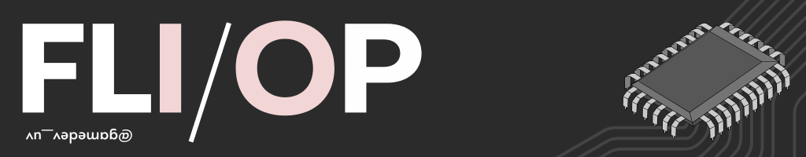
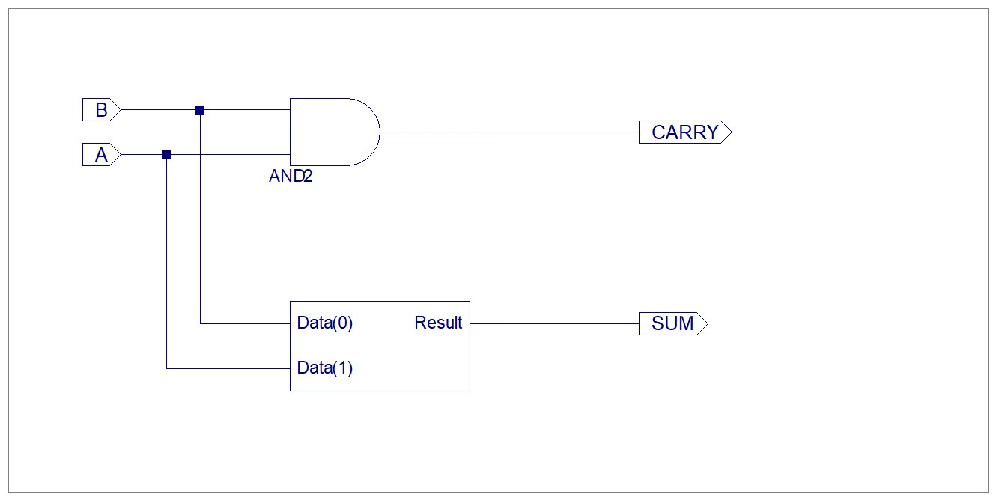
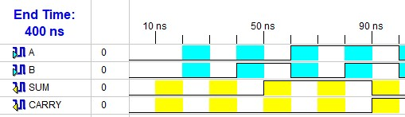
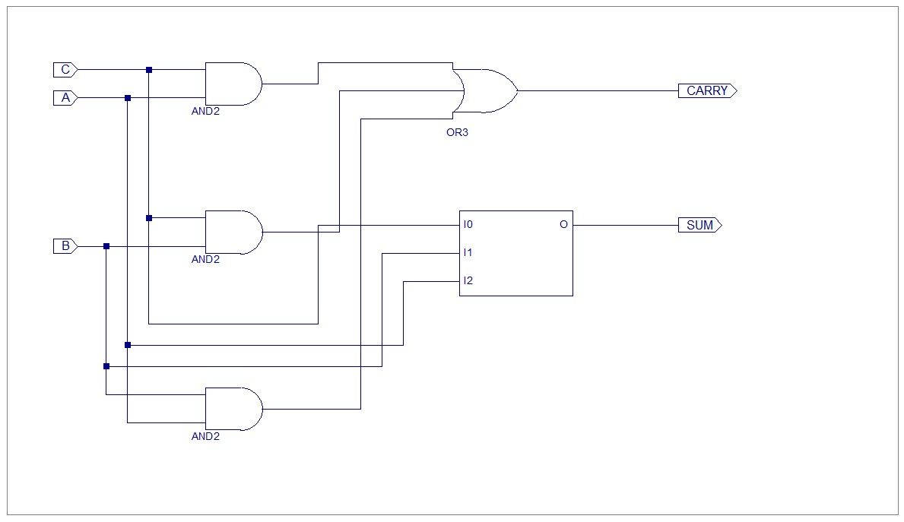
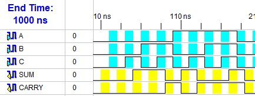
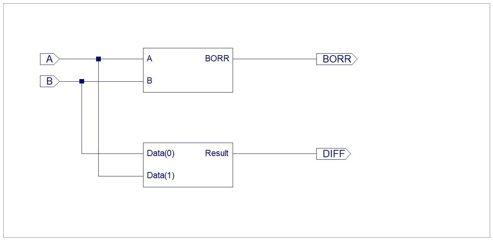
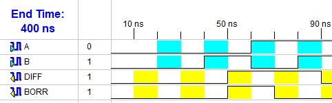
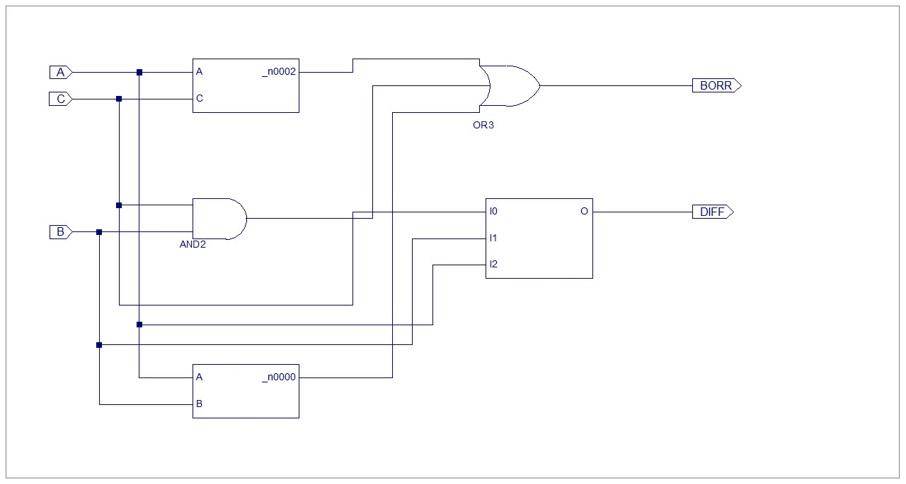
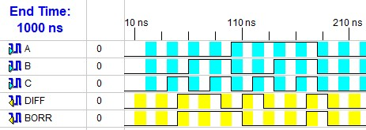

# FlipFlop
Computer Architecture assignments and lab work completed as part of my undergraduate coursework at Sister Nivedita University. 

---

## Experiments
|Sl. No.| Experiment                          | Link|
|:-     | :-:                                 | :-: |
| 1.    | Half and Full Adders                | [Link](#1-half-and-full-adders)   | 
| 2.    | Half and Full Subtractors           | [Link](#1-half-and-full-adders)    |

### 1. Half and Full Adders
Create a Xilinx project and create and test a half adder and a full adder. Use VHDL Modules.

The Xilinx project can be found [here](/Projects/simpleAdders).

#### Half Adder
A half adder is a logic circuit that adds two single-bit binary inputs (A and B). It produces two outputs: a Sum bit and a Carry bit.

| A | B | SUM | CARRY |
|:-:|:-:| :-: |  :-:  |
| 0 | 0 |  0  |   0   |
| 0 | 1 |  1  |   0   |
| 1 | 0 |  1  |   0   |
| 1 | 1 |  0  |   1   |

**Sum** = $ A \oplus B$
**Carry** = $ A \cdot B$

##### VHDL Module
```vhdl
library IEEE;
use IEEE.STD_LOGIC_1164.ALL;
use IEEE.STD_LOGIC_ARITH.ALL;
use IEEE.STD_LOGIC_UNSIGNED.ALL;

entity halfAdder is
    Port ( A, B : in  STD_LOGIC;
           SUM : out  STD_LOGIC;
           CARRY : out  STD_LOGIC);
end halfAdder;

architecture Behavioral of halfAdder is
begin
	SUM <= A XOR B;
	CARRY <= A AND B;
end Behavioral;
```
####  RTL Circuit


####  Test Bench Output


#### Full Adder
A full adder is a logic circuit that adds 3 single-bit binary inputs (A, B, and C). It produces two outputs: a Sum bit and a Carry bit.

| A | B | C | SUM | CARRY |
|:-:|:-:|:-:| :-: |  :-:  |
| 0 | 0 | 0 |  0  |   0   |
| 0 | 0 | 1 |  1  |   0   |
| 0 | 1 | 0 |  1  |   0   |
| 0 | 1 | 1 |  0  |   1   |
| 1 | 0 | 0 |  1  |   0   |
| 1 | 0 | 1 |  0  |   1   |
| 1 | 1 | 0 |  0  |   1   |
| 1 | 1 | 1 |  1  |   1   |

**Sum** = $ A \oplus B \oplus C$
**Carry** = $ (A \cdot B) + (B \cdot C) + (A \cdot C)$

##### VHDL Module
```vhdl
library IEEE;
use IEEE.STD_LOGIC_1164.ALL;
use IEEE.STD_LOGIC_ARITH.ALL;
use IEEE.STD_LOGIC_UNSIGNED.ALL;

entity fullAdder is
    Port ( A, B, C : in  STD_LOGIC;
           SUM : out  STD_LOGIC;
           CARRY : out  STD_LOGIC);
end fullAdder;

architecture Behavioral of fullAdder is
begin
	SUM <= A XOR B XOR C;
	CARRY <= (A AND B) OR (B AND C) OR (A AND C); 
end Behavioral;
```
####  RTL Circuit


####  Test Bench Output


### 2. Half and Full Subtractors
Create a Xilinx project and create and test a half subtractor and a full subtractor. Use VHDL Modules.

The Xilinx project can be found [here](/Projects/simpleSubtractors).

#### Half Subtractor
A half adder is a logic circuit that subtracts two single-bit binary inputs (A and B). It produces two outputs: a Difference bit and a Borrow bit.

| A | B | DIFF | BORR  |
|:-:|:-:| :-:  |  :-:  |
| 0 | 0 |  0   |   0   |
| 0 | 1 |  1   |   1   |
| 1 | 0 |  1   |   0   |
| 1 | 1 |  0   |   0   |

**Sum** = $ A \oplus B$
**Carry** = $ A' \cdot B$

##### VHDL Module
```vhdl
library IEEE;
use IEEE.STD_LOGIC_1164.ALL;
use IEEE.STD_LOGIC_ARITH.ALL;
use IEEE.STD_LOGIC_UNSIGNED.ALL;

entity halfSubtractor is
    Port ( A, B : in  STD_LOGIC;
           DIFF : out  STD_LOGIC;
           BORR : out  STD_LOGIC);
end halfSubtractor;

architecture Behavioral of halfSubtractor is
begin
	DIFF <= A XOR B;
	BORR <= ((NOT A) AND B);
end Behavioral;
```
####  RTL Circuit


####  Test Bench Output


#### Full Subtractor
A full subtractor is a logic circuit that subtracts 3 single-bit binary inputs (A, B, and C). It produces two outputs: a Difference bit and a Borrow bit.

| A | B | C | DIFF | BORR |
|:-:|:-:|:-:| :-:  |  :-:  |
| 0 | 0 | 0 |  0   |   0   |
| 0 | 0 | 1 |  1   |   1   |
| 0 | 1 | 0 |  1   |   1   |
| 0 | 1 | 1 |  0   |   1   |
| 1 | 0 | 0 |  1   |   0   |
| 1 | 0 | 1 |  0   |   0   |
| 1 | 1 | 0 |  0   |   0   |
| 1 | 1 | 1 |  1   |   1   |

**Sum** = $ A \oplus B \oplus C$
**Carry** = $ (A' \cdot B) + (B \cdot C) + (A' \cdot C)$

##### VHDL Module
```vhdl
library IEEE;
use IEEE.STD_LOGIC_1164.ALL;
use IEEE.STD_LOGIC_ARITH.ALL;
use IEEE.STD_LOGIC_UNSIGNED.ALL;

entity fullSubtractor is
    Port ( A, B, C : in  STD_LOGIC;
           DIFF : out  STD_LOGIC;
           BORR : out  STD_LOGIC);
end fullSubtractor;

architecture Behavioral of fullSubtractor is
begin
	DIFF <= A XOR B XOR C;
	BORR <= (NOT(A) AND B) OR (B AND C) OR (NOT(A) AND C); 
end Behavioral;
```
####  RTL Circuit


####  Test Bench Output
