# FlipFlop
Computer Architecture assignments and lab work completed as part of my undergraduate coursework at Sister Nivedita University. 

---

## Experiments
|Sl. No.| Experiment                             | Link												|
|:-     | :-:                                    | :-: 												|
| 1.    | Half and Full Adders                   | [Link](#1-half-and-full-adders)  				| 
| 2.    | Half and Full Subtractors              | [Link](#2-half-and-full-subtractors)    			|
| 3.    | Full Adder using Half Adders           | [Link](#3-full-adder-using-half-adder)    		|
| 4.    | Full Subtrator using Half Subtractors  | [Link](#4-full-subtractor-using-half-subtractor) |
| 5.    | Universal Gates                        | [Link](#5-universal-gates)    					|
| 6.    | MUX 4x1                                | [Link](#6-muliplexer)    						|
| 7.    | Structural MUX                         | [Link](#7-structural-multiplexer)    			|
| 8.    | Demultiplexers                         | [Link](#8-demultiplexers)    					|
| 9.    | Encoder Decoder                        | [Link](#9-encoder--decoder)    					|
| 10.   | 2-bit Comparator                       | [Link](#10-2-bit-comparator)    					|
| 11.   | Ripple Carry Adder                     | [Link](#11-ripple-carry-adder)  					|
| 12.   | BCD Adder                   	         | [Link](#12-bcd-adder)    						|

### 1. Half and Full Adders
Create a Xilinx project and create and test a half adder and a full adder. Use VHDL Modules.

The Xilinx project can be found [here](/Projects/simpleAdders).

#### Half Adder
A half adder is a logic circuit that adds two single-bit binary inputs (A and B). It produces two outputs: a Sum bit and a Carry bit.

| A | B | SUM | CARRY |
|:-:|:-:| :-: |  :-:  |
| 0 | 0 |  0  |   0   |
| 0 | 1 |  1  |   0   |
| 1 | 0 |  1  |   0   |
| 1 | 1 |  0  |   1   |

```math
\text{Sum} = A \oplus B\
```

```math
\text{Carry} = A \cdot B
```

#### VHDL Module
```vhdl
library IEEE;
use IEEE.STD_LOGIC_1164.ALL;
use IEEE.STD_LOGIC_ARITH.ALL;
use IEEE.STD_LOGIC_UNSIGNED.ALL;

entity halfAdder is
    Port ( A, B : in  STD_LOGIC;
           SUM : out  STD_LOGIC;
           CARRY : out  STD_LOGIC);
end halfAdder;

architecture Dataflow of halfAdder is
begin
	SUM <= A XOR B;
	CARRY <= A AND B;
end Dataflow;
```
####  RTL Circuit


####  Test Bench Output


#### Full Adder
A full adder is a logic circuit that adds 3 single-bit binary inputs (A, B, and C). It produces two outputs: a Sum bit and a Carry bit.

| A | B | C | SUM | CARRY |
|:-:|:-:|:-:| :-: |  :-:  |
| 0 | 0 | 0 |  0  |   0   |
| 0 | 0 | 1 |  1  |   0   |
| 0 | 1 | 0 |  1  |   0   |
| 0 | 1 | 1 |  0  |   1   |
| 1 | 0 | 0 |  1  |   0   |
| 1 | 0 | 1 |  0  |   1   |
| 1 | 1 | 0 |  0  |   1   |
| 1 | 1 | 1 |  1  |   1   |

```math
\text{Sum} = A \oplus B \oplus C
```

```math
\text{Carry} = (A \cdot B) + (B \cdot C) + (A \cdot C)
```

#### VHDL Module
```vhdl
library IEEE;
use IEEE.STD_LOGIC_1164.ALL;
use IEEE.STD_LOGIC_ARITH.ALL;
use IEEE.STD_LOGIC_UNSIGNED.ALL;

entity fullAdder is
    Port ( A, B, C : in  STD_LOGIC;
           SUM : out  STD_LOGIC;
           CARRY : out  STD_LOGIC);
end fullAdder;

architecture Dataflow of fullAdder is
begin
	SUM <= A XOR B XOR C;
	CARRY <= (A AND B) OR (B AND C) OR (A AND C); 
end Dataflow;
```
####  RTL Circuit


####  Test Bench Output


### 2. Half and Full Subtractors
Create a Xilinx project and create and test a half subtractor and a full subtractor. Use VHDL Modules.

The Xilinx project can be found [here](/Projects/simpleSubtractors).

#### Half Subtractor
A half subtractor is a logic circuit that subtracts two single-bit binary inputs (A and B). It produces two outputs: a Difference bit and a Borrow bit.

| A | B | DIFF | BORR  |
|:-:|:-:| :-:  |  :-:  |
| 0 | 0 |  0   |   0   |
| 0 | 1 |  1   |   1   |
| 1 | 0 |  1   |   0   |
| 1 | 1 |  0   |   0   |

```math
\text{Difference} = A \oplus B
```

```math
\text{Borrow} = A' \cdot B
```

#### VHDL Module
```vhdl
library IEEE;
use IEEE.STD_LOGIC_1164.ALL;
use IEEE.STD_LOGIC_ARITH.ALL;
use IEEE.STD_LOGIC_UNSIGNED.ALL;

entity halfSubtractor is
    Port ( A, B : in  STD_LOGIC;
           DIFF : out  STD_LOGIC;
           BORR : out  STD_LOGIC);
end halfSubtractor;

architecture Dataflow of halfSubtractor is
begin
	DIFF <= A XOR B;
	BORR <= ((NOT A) AND B);
end Dataflow;
```
####  RTL Circuit


####  Test Bench Output


#### Full Subtractor
A full subtractor is a logic circuit that subtracts 3 single-bit binary inputs (A, B, and C). It produces two outputs: a Difference bit and a Borrow bit.

| A | B | C | DIFF | BORR |
|:-:|:-:|:-:| :-:  |  :-:  |
| 0 | 0 | 0 |  0   |   0   |
| 0 | 0 | 1 |  1   |   1   |
| 0 | 1 | 0 |  1   |   1   |
| 0 | 1 | 1 |  0   |   1   |
| 1 | 0 | 0 |  1   |   0   |
| 1 | 0 | 1 |  0   |   0   |
| 1 | 1 | 0 |  0   |   0   |
| 1 | 1 | 1 |  1   |   1   |

```math
\text{Difference} = A \oplus B \oplus C
```

```math
\text{Borrow} = (A' \cdot B) + (B \cdot C) + (A' \cdot C)
```

#### VHDL Module
```vhdl
library IEEE;
use IEEE.STD_LOGIC_1164.ALL;
use IEEE.STD_LOGIC_ARITH.ALL;
use IEEE.STD_LOGIC_UNSIGNED.ALL;

entity fullSubtractor is
    Port ( A, B, C : in  STD_LOGIC;
           DIFF : out  STD_LOGIC;
           BORR : out  STD_LOGIC);
end fullSubtractor;

architecture Dataflow of fullSubtractor is
begin
	DIFF <= A XOR B XOR C;
	BORR <= (NOT(A) AND B) OR (B AND C) OR (NOT(A) AND C); 
end Dataflow;
```
####  RTL Circuit


####  Test Bench Output


### 3. Full Adder using Half Adder
Create a Xilinx project and create and test a full adder which will be made using 2 half adders.

The Xilinx project can be found [here](/Projects/basicStructural/).

#### Theory 
A full adder can be made by combining 2 half adders. 
We know for a given Half Adder. 

```math
\text{Sum} = A \oplus B
```

```math
\text{Carry} = A \cdot B
```

So if we have the inputs `A`, `B` and `C`.
Then we can pass `A`, `B` to the half adder and get 
```math
S_1 = A \oplus B\newline
C_1 = A \cdot B
```

Then using we can plug the sum of the first half adder and the input C into another half adder. Then we get 
```math
S_2 = S_1 \oplus C\newline
C_2 = S_1 \cdot C\newline
```

```math
\text{Sum} = S_2 = A \oplus B \oplus C\newline
```

The carries we get can be combined using a OR gate
```math
\begin{align*}
\text{Carry} &= C_1 + C_2 \\
&= A \cdot B + S_1 \cdot C \\
&= A \cdot B + (A \oplus B) \cdot C \\
&= A \cdot B + (A'B + AB')\cdot C \\
&= A \cdot B + (A'B + AB')\cdot C \\
&= A \cdot B \cdot (C + C') + (A'B + AB')\cdot C \\
&= ABC + ABC' + A'BC + AB'C
\end{align*}
```

Solving using K-MAP: 
|     | B'C'|  B'C | BC  | BC' | 
| :-: | :-: |  :-: | :-: | :-: |
|  A'  |     |      |  1  |    |
|  A   |     |   1  |  1  |  1 |

```math
\text{Carry} = AB + BC + CA
```

The expressions we get for carry and sum this way match the expressions for a full adder thus 2 half adders can be used in this way to make a full adder.

In Xilinx we can have to do this using Structural Modules. We need a half adder module which we can then make a full adder module. 

#### Half Adder VHDL Module
```vhdl
library IEEE;
use IEEE.STD_LOGIC_1164.ALL;

entity halfAdder is
    Port ( A, B : in  STD_LOGIC;
           SUM, CARRY : out  STD_LOGIC);
end halfAdder;

architecture Dataflow of halfAdder is
begin
	SUM <= A XOR B;
	CARRY <= A AND B;
end Dataflow;
```

> [!NOTE] 
> Then we can create the Full Adder in several ways. 2 ways have been showcased below. 

#### Full Adder VHDL Module (Component Instantiation)
```vhdl
library IEEE;
use IEEE.STD_LOGIC_1164.ALL;

entity fullAdderComponents is
    Port ( A, B, C : in  STD_LOGIC;
           SUM : out  STD_LOGIC;
           CARRY : out  STD_LOGIC);
end fullAdderComponents;

architecture Structural of fullAdderComponents is

Component halfAdder
	    Port ( A, B : in  STD_LOGIC;
           SUM, CARRY : out  STD_LOGIC);
end Component;

SIGNAL S1, C1, C2 : STD_LOGIC;
begin
	H1: halfAdder Port Map(A => A, B => B, SUM => S1, CARRY => C1);
	H2: halfAdder Port Map(A => S1, B => C, SUM => SUM, CARRY => C2);
	CARRY <= C1 OR C2;
end Structural;
```

#### Full Adder VHDL Module (Direct Entity Instantiation)
```vhdl
library IEEE;
use IEEE.STD_LOGIC_1164.ALL;

entity fullAdderSimplified is
    Port ( A, B, C : in  STD_LOGIC;
           SUM, CARRY : out  STD_LOGIC);
end fullAdderSimplified;

architecture Structural of fullAdderSimplified is

SIGNAL S1, C1, C2 : STD_LOGIC;
begin
	H1: entity work.halfAdder Port Map(A => A, B => B, SUM => S1, CARRY => C1);
	H2: entity work.halfAdder Port Map(A => S1, B => C, SUM => SUM, CARRY => C2);
	CARRY <= C1 OR C2;
end Structural;
```

> [!TIP]
> When mapping the ports the inputs can be written directly (similar to how methods are called).
> So instead of: 
> ```vhdl
> Port Map(A => A, B => B, SUM => S1, CARRY => C1);
> ```
> We can also just write:
> ```vhdl
> Port Map(A, B, S1, C1);
> ```
> But I prefer writing the name of the ports so it is clear to the reader what is being passed as input, as Xilinx doesn't have any built-in method peek functionality.

####  RTL Circuit


####  Test Bench Output


### 4. Full Subtractor using Half Subtractor
Create a Xilinx project and create and test a full subtractor which will be made using 2 half subtractor.

The Xilinx project can be found [here](/Projects/basicStructural/).

We already proved how a full adder can be created with 2 half adders and an OR gate, we can similarly use 2 half subtrators along with an OR gate to create a full subtractor.

#### Full Subtractor VHDL Module (Component Instantiation)
```vhdl
library IEEE;
use IEEE.STD_LOGIC_1164.ALL;

entity fullSubtractorComponents is
    Port ( A, B, C : in  STD_LOGIC;
           DIFF, BORR : out  STD_LOGIC);
end fullSubtractorComponents;

architecture Structural of fullSubtractorComponents is

Component halfSubtractor
	    Port ( A, B : in  STD_LOGIC;
           DIFF, BORR : out  STD_LOGIC);
end Component;
SIGNAL D1, B1, B2 : STD_LOGIC;
begin
	HS1 : entity halfSubtractor Port Map(A => A, B => B, DIFF => D1, BORR => B1);
	HS2 : entity halfSubtractor Port Map(A => D1, B => C, DIFF => DIFF, BORR => B2);
	BORR <= B1 OR B2;
end Structural;
```

#### Full Subtractor VHDL Module (Direct Entity Instantiation)
```vhdl
library IEEE;
use IEEE.STD_LOGIC_1164.ALL;

entity fulllSubtractorSimplified is
    Port ( A, B, C : in  STD_LOGIC;
           DIFF, BORR : out  STD_LOGIC);
end fulllSubtractorSimplified;

architecture Structural of fulllSubtractorSimplified is
SIGNAL D1, B1, B2 : STD_LOGIC;
begin
	HS1 : entity work.halfSubtractor Port Map(A => A, B => B, DIFF => D1, BORR => B1);
	HS2 : entity work.halfSubtractor Port Map(A => D1, B => C, DIFF => DIFF, BORR => B2);
	BORR <= B1 OR B2;
end Structural; 
```
#### RTL Circuit


#### Test Bench Output


> [!NOTE]
> Even though both methods have been showcased here, I'll be using Direct Entity Instantiation from now on.

### 5. Universal Gates
Create the AND and OR gates using only the universal gates (NOR, NAND). Use VHDL modules in Xilinx. 
The project can be found [here](/Projects/universalGates/).

#### Universal Gates
The NAND and NOR gates are often called the Universal gates as they can be used to recreate all the other gates. 

The NAND gate is the negation of the output of a NAND gate.
| A | B | AND | NAND |
|:-:|:-:| :-: |  :-: |
| 0 | 0 |  0  |   1  |
| 0 | 1 |  0  |   1  |
| 1 | 0 |  0  |   1  |
| 1 | 1 |  1  |   0  |

```math
A \text{ NAND } B = (A \cdot B)' = A' + B'
```

The NOR gate is the negation of the output of a OR gate.
| A | B | OR  |  NOR |
|:-:|:-:| :-: |  :-: |
| 0 | 0 |  0  |   1  |
| 0 | 1 |  1  |   0  |
| 1 | 0 |  1  |   0  |
| 1 | 1 |  1  |   0  |

```math
A \text{ NOR } B = (A + B)' = A' \cdot B'
```

#### NOT using NAND VHDL Module
```vhdl
library IEEE;
use IEEE.STD_LOGIC_1164.ALL;

entity notUsingNand is
    Port ( A : in  STD_LOGIC;
           ANOT : out  STD_LOGIC);
end notUsingNand;

architecture Structural of notUsingNand is
begin
		NAND1: entity work.nandGate Port Map(A => A, B => A, Z => ANOT);
end Structural;
```

$$
\begin{aligned}
ANOT &= (A \cdot A)' = (A)' = A'
\end{aligned}
$$

#### NOT using NOR VHDL Module
```vhdl
library IEEE;
use IEEE.STD_LOGIC_1164.ALL;

entity notUsingNor is
    Port ( A : in  STD_LOGIC;
           ANOT : out  STD_LOGIC);
end notUsingNor;

architecture Structural of notUsingNor is
begin
	NOR1 : entity work.norGate Port Map(A => A, B => A, Z => ANOT);
end Structural;
```

$$
\begin{aligned}
ANOT &= (A + A)' = (A)' = A'
\end{aligned}
$$

#### AND using NAND VHDL Module
```vhdl
library IEEE;
use IEEE.STD_LOGIC_1164.ALL;

entity andUsingNand is
    Port ( A, B : in  STD_LOGIC;
           Z : out  STD_LOGIC);
end andUsingNand;

architecture Structural of andUsingNand is
SIGNAL O_1 : STD_LOGIC;
begin
	NAND1 : entity work.nandGate Port Map(A => A, B => B, Z => O_1);
	NAND2 : entity work.nandGate Port Map(A => O_1, B => O_1, Z => Z); 
end Structural;
```
$$
\begin{aligned}
O_1 &= (A \cdot B)' \\
Z &= (O_1 \cdot O_1)' = (O_1)' = ((A \cdot B)')' = A \cdot B
\end{aligned}
$$

#### AND using NOR VHDL Module
```vhdl
library IEEE;
use IEEE.STD_LOGIC_1164.ALL;

entity andUsingNor is
    Port ( A, B : in  STD_LOGIC;
           Z : out  STD_LOGIC);
end andUsingNor;

architecture Structural of andUsingNor is
SIGNAL notA, notB : STD_LOGIC;
begin
	NOR1 : entity work.norGate Port Map(A => A, B => A, Z => notA);
	NOR2 : entity work.norGate Port Map(A => B, B => B, Z => notB);
	NOR3 : entity work.norGate Port Map(A => notA, B => notB, Z => Z);
end Structural;
```

$$
Z = (A' + B')' = A'' \cdot B'' = A \cdot B
$$

#### OR using NAND VHDL Module
```vhdl
library IEEE;
use IEEE.STD_LOGIC_1164.ALL;

entity orUsingNand is
    Port ( A, B : in  STD_LOGIC;
           Z : out  STD_LOGIC);
end orUsingNand;

architecture Structural of orUsingNand is
SIGNAL notA, notB, STD_LOGIC;
begin
	NAND1: entity work.nandGate Port Map(A => A, B => A, Z => notA);
	NAND2: entity work.nandGate Port Map(A => B, B => B, Z => notB);
	NAND3: entity work.nandGate Port Map(A => notA, B => notB, Z => Z);
end Structural;
```

$$
Z = (A' \cdot B')' = A'' + B'' = A + B
$$

#### OR using NOR VHDL Module
```vhdl
library IEEE;
use IEEE.STD_LOGIC_1164.ALL;

entity orUsingNor is
    Port ( A, B : in  STD_LOGIC;
           Z : out  STD_LOGIC);
end orUsingNor;

architecture Structural of orUsingNor is
SIGNAL O_1 : STD_LOGIC;
begin
	NOR1 : entity work.norGate Port Map(A => A, B => B, Z => O_1);
	NOR2 : entity work.norGate Port Map(A => O_1, B => O_1, Z => Z);
end Structural;
```
$$
\begin{aligned}
O_1 &= (A + B)' \\
Z &= (O_1 + O_1)' = (O_1)' = ((A + B)')' = A + B
\end{aligned}
$$

### 6. Muliplexer
Create a 4x1 MUX using VHDL modules in Xilinx. 
The project can be found [here](/Projects/Multiplixer4x1/).

#### Multiplexer (MUX)
A multiplexer is used to select between $2^n$ given inputs by utilizing $n$ selection line inputs.

A general MUX is defined as a $2^n$x1. So a 4x1 MUX has 2 selection line inputs and can be used to select between 4 input values, let's call them $I_0$, $I_1$, $I_2$ and $I_3$ respectively. And the selection line inputs are labelled as $S_0$ and $S_1$.

We can form a truth table which looks like this -
| $S_1$ | $S_0$ | Output |
|   :-: | :-:   | :-:    |
|   0   | 0     | $I_0$  |
|   0   | 1     | $I_1$  |
|   1   | 0     | $I_2$  |
|   1   | 1     | $I_3$  |

So the output can be represented as -
```math
\begin{align*}
\text{Y} &= S_0' \cdot S_1' \cdot I_0\\
         &+ S_0' \cdot S_1 \cdot I_1\\
         &+ S_0 \cdot S_1' \cdot I_2\\
         &+ S_0 \cdot S_1 \cdot I_3\\
\end{align*}
```

There are several ways to represent this within VHDL. Some of the ways have been showcased below.

#### VDHL Modules 
##### Using basic operations
```vhdl
library IEEE;
use IEEE.STD_LOGIC_1164.ALL;

entity mux4x1 is
    Port ( I : in  STD_LOGIC_VECTOR (03 downto 0);
           S : in  STD_LOGIC_VECTOR (01 downto 0);
           Y : out  STD_LOGIC);
end mux4x1;

architecture Dataflow of mux4x1 is
begin
	Y <= ((I(0) AND (NOT S(1)) AND (NOT S(0))) OR
		   (I(1) AND (NOT S(1)) AND (    S(0))) OR
		   (I(2) AND (    S(1)) AND (NOT S(0))) OR
		   (I(3) AND (    S(1)) AND (    S(0))));
end Dataflow;
```

##### Using select statement

```vhdl
library IEEE;
use IEEE.STD_LOGIC_1164.ALL;

entity mux4x1usingSelect is
    Port ( I : in  STD_LOGIC_VECTOR (3 downto 0);
           S : in  STD_LOGIC_VECTOR (1 downto 0);
           Y : out  STD_LOGIC);
end mux4x1usingSelect;

architecture Dataflow of mux4x1usingSelect is
begin
	with S select
		Y <= I(0) when "00",
			  I(1) when "01",
			  I(2) when "10",
			  I(3) when "11",
			  '0'  when others;
end Dataflow;
```

##### Using case statements
```vhdl
library IEEE;
use IEEE.STD_LOGIC_1164.ALL;

entity mux4x1UsingCase is
    Port ( I : in  STD_LOGIC_VECTOR (3 downto 0);
           S : in  STD_LOGIC_VECTOR (1 downto 0);
           Y : out  STD_LOGIC);
end mux4x1UsingCase;

architecture Behavioral of mux4x1UsingCase is
begin
	process(I, S)
		begin
		
			case S is 
				when "00" =>
					Y <= I(0);
				when "01" => 
					Y <= I(1);
				when "10" => 
					Y <= I(2);
				when "11" =>
					Y <= I(3);
				when others => 
					Y <= '0';
					
			end case;
			
		end process;
end Behavioral;
```

##### Using conditional statements
```vhdl
library IEEE;
use IEEE.STD_LOGIC_1164.ALL;

entity mux4x1UsingConditional is
    Port ( I : in  STD_LOGIC_VECTOR (3 downto 0);
           S : in  STD_LOGIC_VECTOR (1 downto 0);
           Y : out  STD_LOGIC);
end mux4x1UsingConditional;

architecture Behavioral of mux4x1UsingConditional is
begin
	process(I, S)
		begin
			if S = "00" then
				Y <= I(0);
			elsif S = "01" then
				Y <= I(1);
			elsif S = "10" then 
				Y <= I(2);
			elsif S = "11" then 
				Y <= I(3);
			else
				Y <= '0';
			end if;
		end process;
end Behavioral;
```

> [!NOTE]
> As conditional statements and case statements are executed sequentially unlike they must be enclosed within a `process`.

####  RTL Circuit
Using normal gates we get -
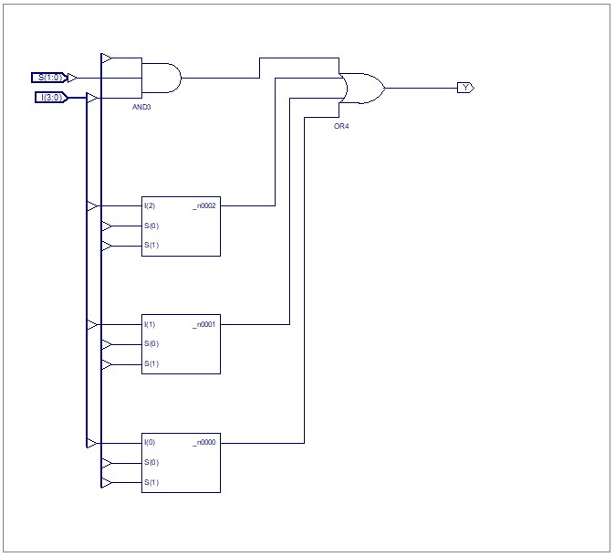

Whereas using any of the other 3 methods we get a similar RTL Circuit
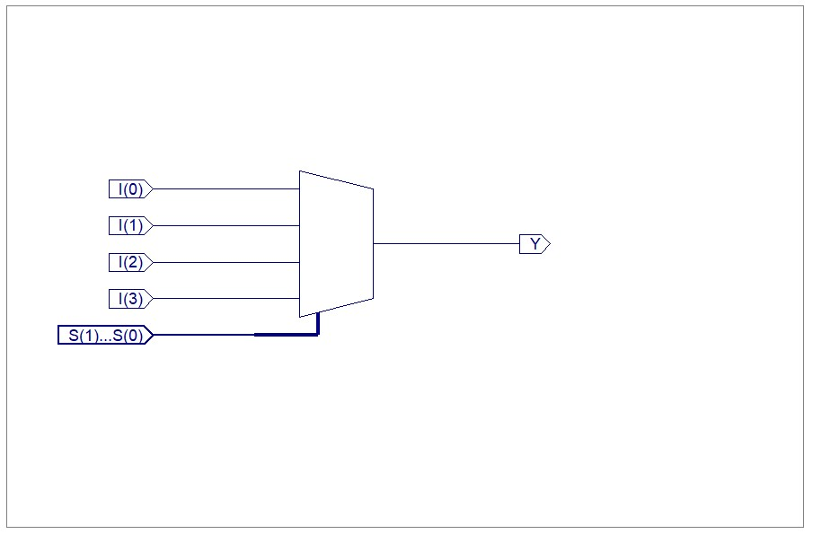

####  Test Bench Output
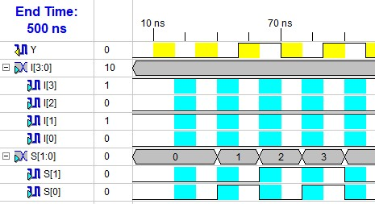
But of course all of them produce the same output.

### 7. Structural Multiplexer
Using only 4x1 MUX and 2x1 MUX at a time create 
- 8x1 MUX
- 16x1 MUX

Use VHDL Modules in Xilinx.

The project can be found [here](/Projects/Multiplexer8x1&16x1/).

### Theory
We can divide the selection process and keep in the MUX in "layers" which will help select a smaller part of the currently selected inputs. We will use the same mental model throughout all the problems, even if the final implementation will be different.

#### 2x1 and 4x1 MUX 
I have created these modules using Select but one can definetely create them using the other methods discussed above

##### 2x1 MUX 
```vhdl
library IEEE;
use IEEE.STD_LOGIC_1164.ALL;

entity MUX2x1 is
    Port ( I : in  STD_LOGIC_VECTOR (1 downto 0);
           S : in  STD_LOGIC;
           Y : out  STD_LOGIC);
end MUX2x1;

architecture Dataflow of MUX2x1 is
begin
	with S select 
		Y <= I(0) when '0',
			  I(1) when '1',
			  '0'  when others;
end Dataflow;
```

##### 4x1 MUX 
```vhdl
library IEEE;
use IEEE.STD_LOGIC_1164.ALL;

entity MUX4x1 is
    Port ( I : in  STD_LOGIC_VECTOR (3 downto 0);
           S : in  STD_LOGIC_VECTOR (1 downto 0);
           Y : out  STD_LOGIC);
end MUX4x1;

architecture Dataflow of MUX4x1 is
begin
	with S select 
		Y <= I(0) when "00",
		     I(1) when "01",
			  I(2) when "10",
			  I(3) when "11",
			  '0'  when others;
end Dataflow;
```

#### Creating 8x1 MUX
##### Using 4x1 MUX

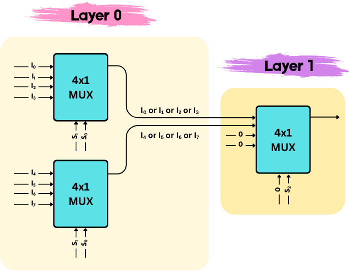

Here we have used 2 4x1 MUX to select between the 2 groups (Using $S_0$ and $S_1$). Wheras the final selection between these output of these 2 groups is being made by another 4x1 MUX. ($S_2$).


Here we can see that the columns B and C are repeating. And they have 4 unique combinations which can be used to select one between the 2 groups each having 4 inputs. And then we can simply choose one from there using the column A which is represented by $S_2$.

#### VHDL Module
```vhdl
library IEEE;
use IEEE.STD_LOGIC_1164.ALL;

entity MUX8x1using4x1 is
    Port ( I : in  STD_LOGIC_VECTOR (7 downto 0);
           S : in  STD_LOGIC_VECTOR (2 downto 0);
           Y : out  STD_LOGIC);
end MUX8x1using4x1;

architecture Structural of MUX8x1using4x1 is
SIGNAL L0Y : STD_LOGIC_VECTOR (1 downto 0);

begin
	L0M0 : entity work.MUX4x1 Port Map(I => I(3 downto 0), S => S(1 downto 0), Y => L0Y(0));
	L0M1 : entity work.MUX4x1 Port Map(I => I(7 downto 4), S => S(1 downto 0), Y => L0Y(1));
	L1M1 : entity work.MUX4x1 Port Map(I(0) => L0Y(0), I(1) =>  L0Y(1), I(2) => '0', I(3) => '0',
												  S(0) => S(2), S(1) => '0', Y => Y);
end Structural;
```
> [!TIP]
> In the code `L0Y` is used store the outputs from the MUX which are layer 0. Through this experiment we will be using `L{i}Y` which will be the output of the `i`th layer. 
>
> Similarly `L{i}M{j}` represents the `j`th MUX in the `i`th layer.  
> Here we are using vectors (basically an array of `STD_LOGIC`). But one can also replicate the same behaviour using raw `STD_LOGIC` as outputs.  
>
> Using the same logic we can build the others.

####  RTL Circuit
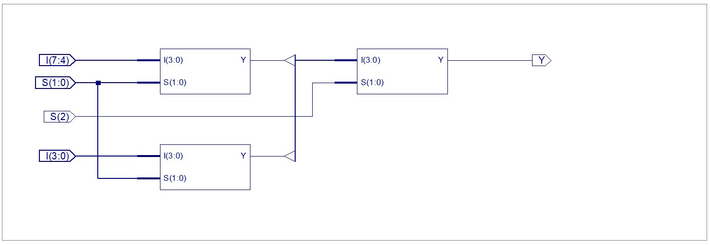

#### Using 2x1 MUX
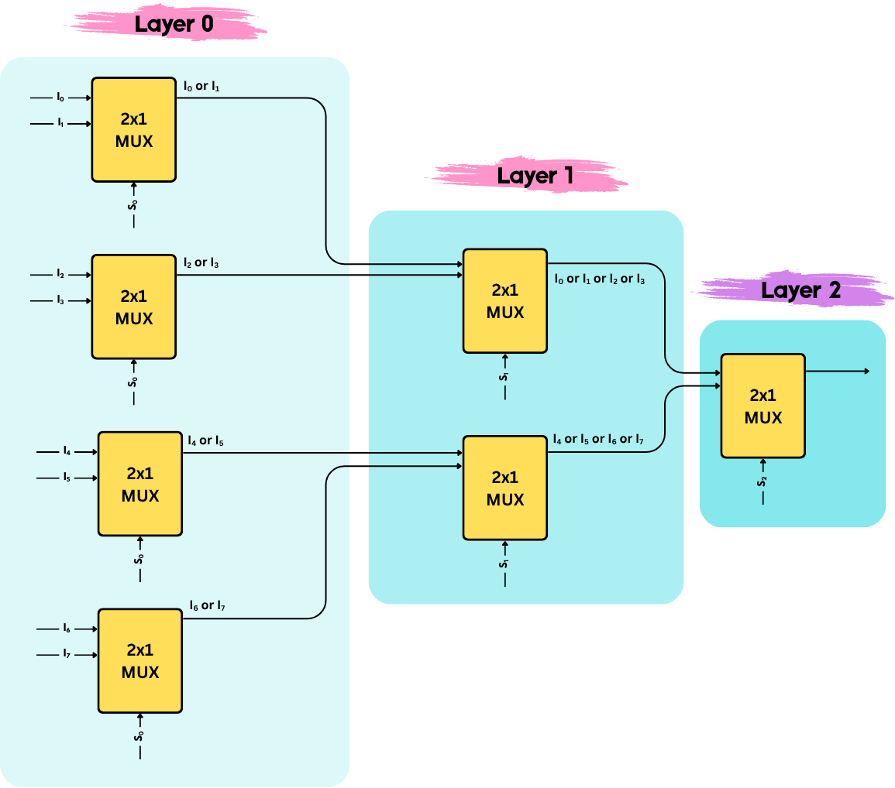

```vhdl
library IEEE;
use IEEE.STD_LOGIC_1164.ALL;

entity MUX8x1using2x1 is
    Port ( I : in  STD_LOGIC_VECTOR (7 downto 0);
           S : in  STD_LOGIC_VECTOR (2 downto 0);
           Y : out  STD_LOGIC);
end MUX8x1using2x1;

architecture Structural of MUX8x1using2x1 is

SIGNAL L0Y : STD_LOGIC_VECTOR (3 downto 0);
SIGNAL L1Y : STD_LOGIC_VECTOR (1 downto 0);

begin
	L0MUX0 : entity work.MUX2x1 Port Map(I => I(1 downto 0), S => S(0), Y => L0Y(0));
	L0MUX1 : entity work.MUX2x1 Port Map(I => I(3 downto 2), S => S(0), Y => L0Y(1));
	L0MUX2 : entity work.MUX2x1 Port Map(I => I(5 downto 4), S => S(0), Y => L0Y(2));
	L0MUX3 : entity work.MUX2x1 Port Map(I => I(7 downto 6), S => S(0), Y => L0Y(3));
	
	L1MUX0 : entity work.MUX2x1 Port Map(I => L0Y(1 downto 0), S => S(1), Y => L1Y(0));
	L1MUX1 : entity work.MUX2x1 Port Map(I => L0Y(3 downto 2), S => S(1), Y => L1Y(1));
	
	L2MUX0 : entity work.MUX2x1 Port Map(I => L1Y(1 downto 0), S => S(2), Y => Y);
end Structural;
```

####  RTL Circuit
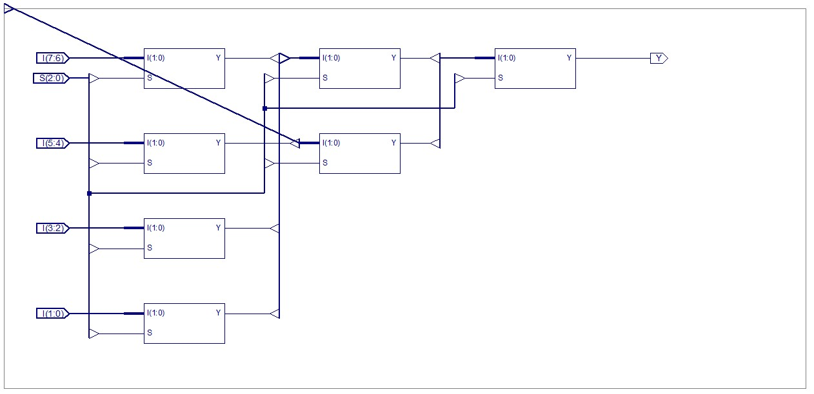

####  Test Bench Output for 8x1 MUX
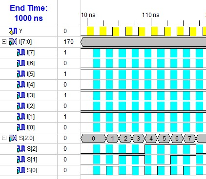

#### Creating 16x1 MUX
##### Using 4x1 MUX

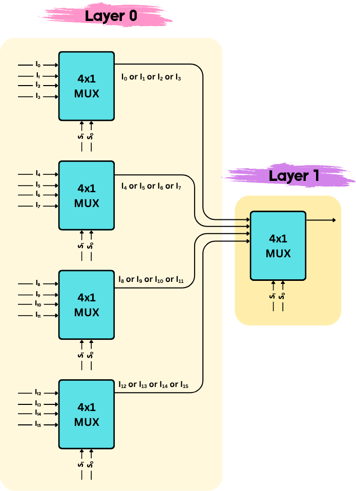

```vhdl
library IEEE;
use IEEE.STD_LOGIC_1164.ALL;

entity MUX16x1using4x1 is
    Port ( I : in  STD_LOGIC_VECTOR (15 downto 0);
           S : in  STD_LOGIC_VECTOR (3 downto 0);
           Y : out  STD_LOGIC);
end MUX16x1using4x1;

architecture Structural of MUX16x1using4x1 is
SIGNAL L0Y : STD_LOGIC_VECTOR (3 downto 0);
begin
	L0M0 : entity work.MUX4x1 Port Map(I => I(3 downto 0),   S => S(1 downto 0), Y => L0Y(0));
	L0M1 : entity work.MUX4x1 Port Map(I => I(7 downto 4),   S => S(1 downto 0), Y => L0Y(1));
	L0M2 : entity work.MUX4x1 Port Map(I => I(11 downto 8),  S => S(1 downto 0), Y => L0Y(2));
	L0M3 : entity work.MUX4x1 Port Map(I => I(15 downto 12), S => S(1 downto 0), Y => L0Y(3));
	
	L1M0 : entity work.MUX4x1 Port Map(I => L0Y(3 downto 0), S => S(3 downto 2), Y => Y);
end Structural;
```

####  RTL Circuit


##### Using 2x1 MUX

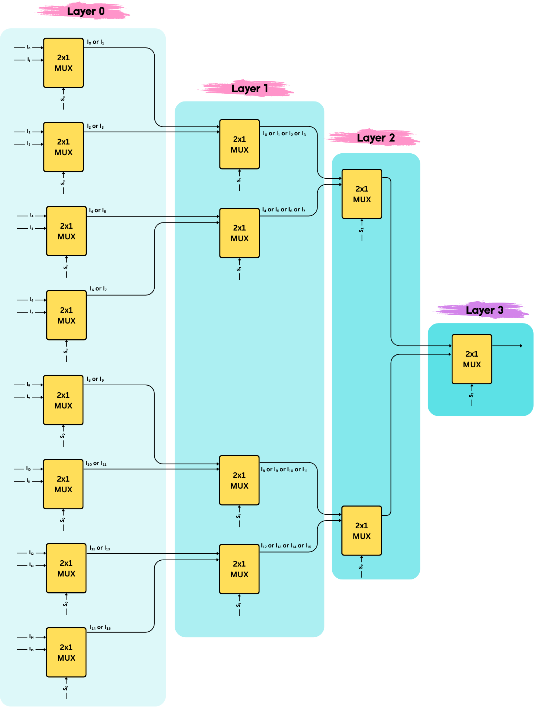

```vhdl
library IEEE;
use IEEE.STD_LOGIC_1164.ALL;

entity MUX16x1using2x1 is
    Port ( I : in  STD_LOGIC_VECTOR (15 downto 0);
           S : in  STD_LOGIC_VECTOR (3 downto 0);
           Y : out  STD_LOGIC);
end MUX16x1using2x1;

architecture Structural of MUX16x1using2x1 is
SIGNAL L0Y : STD_LOGIC_VECTOR (7 downto 0);
SIGNAL L1Y : STD_LOGIC_VECTOR (3 downto 0);
SIGNAL L2Y : STD_LOGIC_VECTOR (1 downto 0);
begin
	L0MUX0 : entity work.MUX2x1 Port Map(I => I( 1 downto 0),  S => S(0), Y => L0Y(0));
	L0MUX1 : entity work.MUX2x1 Port Map(I => I( 3 downto 2),  S => S(0), Y => L0Y(1));
	L0MUX2 : entity work.MUX2x1 Port Map(I => I( 5 downto 4),  S => S(0), Y => L0Y(2));
	L0MUX3 : entity work.MUX2x1 Port Map(I => I( 7 downto 6),  S => S(0), Y => L0Y(3));
	L0MUX4 : entity work.MUX2x1 Port Map(I => I( 9 downto 8),  S => S(0), Y => L0Y(4));
	L0MUX5 : entity work.MUX2x1 Port Map(I => I(11 downto 10), S => S(0), Y => L0Y(5));
	L0MUX6 : entity work.MUX2x1 Port Map(I => I(13 downto 12), S => S(0), Y => L0Y(6));
	L0MUX7 : entity work.MUX2x1 Port Map(I => I(15 downto 14), S => S(0), Y => L0Y(7));
	
	L1MUX0 : entity work.MUX2x1 Port Map(I => L0Y(1 downto 0), S => S(1), Y => L1Y(0));
	L1MUX1 : entity work.MUX2x1 Port Map(I => L0Y(3 downto 2), S => S(1), Y => L1Y(1));
	L1MUX2 : entity work.MUX2x1 Port Map(I => L0Y(5 downto 4), S => S(1), Y => L1Y(2));
	L1MUX3 : entity work.MUX2x1 Port Map(I => L0Y(7 downto 6), S => S(1), Y => L1Y(3));
	
	L2MUX0 : entity work.MUX2x1 Port Map(I => L1Y(1 downto 0), S => S(2), Y => L2Y(0));
	L2MUX1 : entity work.MUX2x1 Port Map(I => L1Y(3 downto 2), S => S(2), Y => L2Y(1));
	
	L3MUX1 : entity work.MUX2x1 Port Map(I => L2Y(1 downto 0), S => S(3), Y => Y);
end Structural;
```

####  RTL Circuit
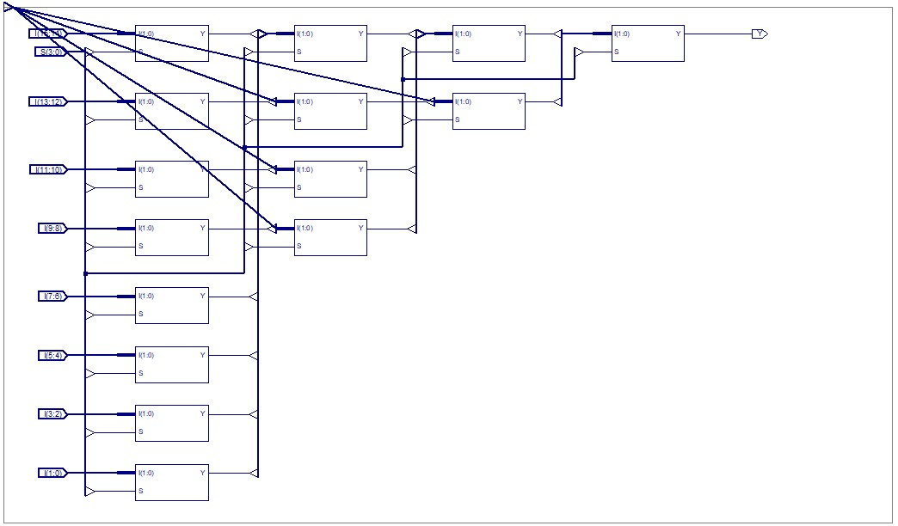

####  Test Bench Output for 16x1 MUX
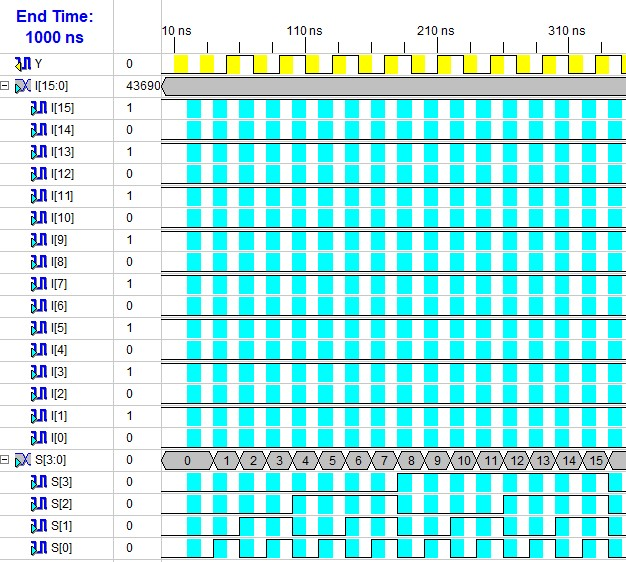

### 8. Demultiplexers
Create a 1x4 DEMUX and use it to create 1x8 and 1x16 DE-MUX using VHDL module(s) in Xilinx.

The Xilinx project can be found [here](/Projects/DeMUX/).

### Theory
A demultiplexer is used to redirect a given input I between $2^n$ given output lines by utilizing n selection line inputs. A general DEMUX is defined as a 1x$2^n$. So, a 1x4 DEMUX has 2 selection line inputs and can be used to redirect the input between 4 output lines, let's call them $S_0$ | $O_0$ , $O_1$ , $O_2$ , $O_3$ respectively. And the selection line inputs are labelled as $S_0$ and $S_1$. We can form a truth table which looks like this –

| $S_1$  | $S_0$ | $O_0$ | $O_1$ | $O_2$ | $O_3$ | 
| :-: | :-: | :-: | :-: | :-: | :-: |
| 0 | 0	| I | 0 | 0 | 0 | 
| 0 | 1	| 0	| I | 0 | 0 | 	
| 1 | 0	| 0	| 0 | I | 0 | 
| 1 | 1	| 0	| 0 | 0 | I | 

Which gives the formulas expressions for the 4 outputs - 
```math
\begin{align*}
O_0 = S_1'S_0'I \\
O_1 = S_1'S_0I \\
O_2 = S_1S_0'I \\
O_3 = S_1S_0I \\
\end{align*}
```

As discussed before there are several ways to represent this within VHDL. We have used case statements.

#### 1x4 DEMUX VHDL Module
```vhdl
library IEEE;
use IEEE.STD_LOGIC_1164.ALL;

entity DEMUX1x4 is
    Port ( I : in  STD_LOGIC;
           S : in  STD_LOGIC_VECTOR (1 downto 0);
           Y : out  STD_LOGIC_VECTOR (3 downto 0));
end DEMUX1x4;

architecture Behavioral of DEMUX1x4 is
begin
	process(I, S)
		begin
			Y <= "0000";
			case S is 
				when "00" =>
					Y(0) <= I;
				when "01" => 
					Y(1) <= I;
				when "10" =>
					Y(2) <= I;
				when "11" =>
					Y(3) <= I;
				when others =>
					Y <= "0000";
			end case;
		end process;
end Behavioral;
```
####  RTL Circuit
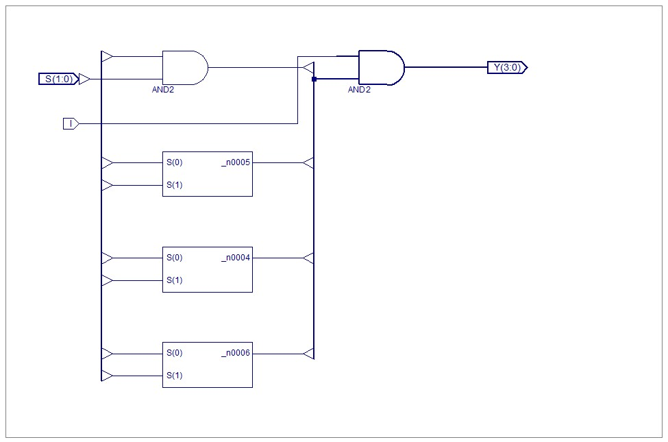

#### Test Bench Waveform
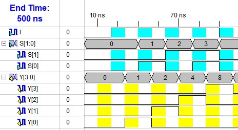

> [!NOTE]
> Similarly the `1x8` DEMUX and `1x16` DEMUX are used to direct a single input in between 8 and 16 output lines respectively. And just how we could create a bigger MUX using smaller MUX we can craete bigger DEMUX using smaller DEMUX. 
> 
> Just how we divided the truth table into several parts and then linked them up we can do something similar and create these bigger DEMUX.

#### 1x8 DEMUX using 1x4 
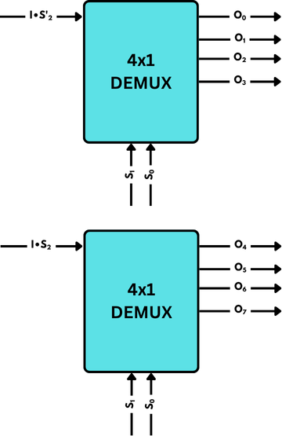

##### VHDL Module
```vhdl
library IEEE;
use IEEE.STD_LOGIC_1164.ALL;

entity DEMUX1x8 is
    Port ( I : in  STD_LOGIC;
           S : in  STD_LOGIC_VECTOR (2 downto 0);
           Y : out  STD_LOGIC_VECTOR (7 downto 0));
end DEMUX1x8;

architecture Structural of DEMUX1x8 is
SIGNAL I_0, I_1 : STD_LOGIC;
begin
	I_0 <= I AND NOT(S(2)); 
	I_1 <= I AND S(2); 
	
	DMUX0 : entity work.DEMUX1x4 Port Map(I => I_0, S => S(1 downto 0), Y => Y(3 downto 0));
	DMUX1 : entity work.DEMUX1x4 Port Map(I => I_1, S => S(1 downto 0), Y => Y(7 downto 4));
end Structural;
```

####  RTL Circuit
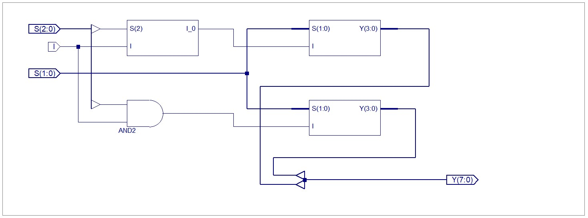

#### Test Bench Waveform
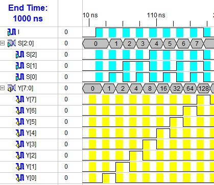

#### 1x16 DEMUX using 1x4 
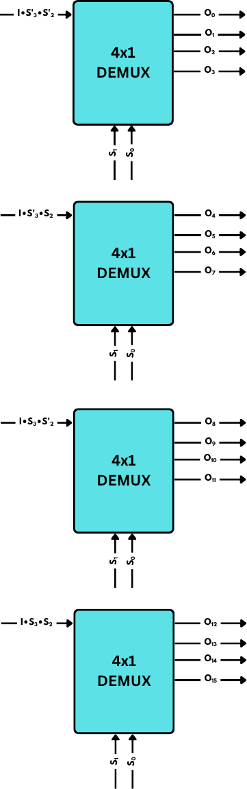

##### VHDL Module
```vhdl
library IEEE;
use IEEE.STD_LOGIC_1164.ALL;

entity DEMUX1x16 is
    Port ( I : in  STD_LOGIC;
           S : in  STD_LOGIC_VECTOR (3 downto 0);
           Y : out  STD_LOGIC_VECTOR (15 downto 0));
end DEMUX1x16;

architecture Structural of DEMUX1x16 is
SIGNAL I_N : STD_LOGIC_VECTOR (3 downto 0);
begin
	I_N(0) <= I AND NOT(S(3)) AND NOT(S(2));
	I_N(1) <= I AND NOT(S(3)) AND    (S(2));
	I_N(2) <= I AND    (S(3)) AND NOT(S(2));
	I_N(3) <= I AND    (S(3)) AND    (S(2));
	
	DMUX0 : entity work.DEMUX1x4 Port Map(I => I_N(0), S => S(1 downto 0), Y => Y( 3 downto 0));
	DMUX1 : entity work.DEMUX1x4 Port Map(I => I_N(1), S => S(1 downto 0), Y => Y( 7 downto 4));
	DMUX2 : entity work.DEMUX1x4 Port Map(I => I_N(2), S => S(1 downto 0), Y => Y(11 downto 8));
	DMUX3 : entity work.DEMUX1x4 Port Map(I => I_N(3), S => S(1 downto 0), Y => Y(15 downto 12));
end Structural;
```

####  RTL Circuit
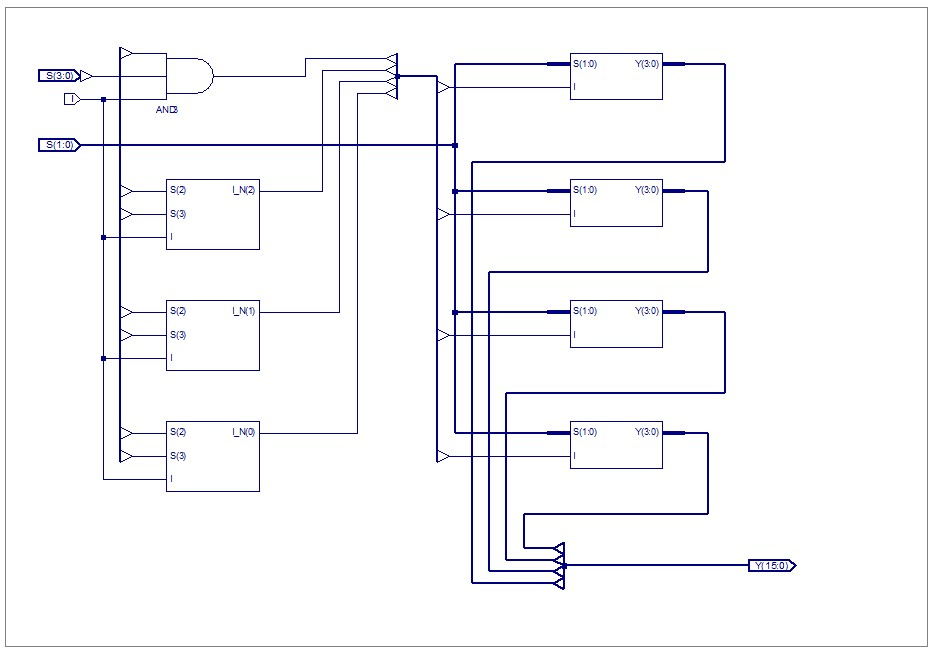

#### Test Bench Waveform
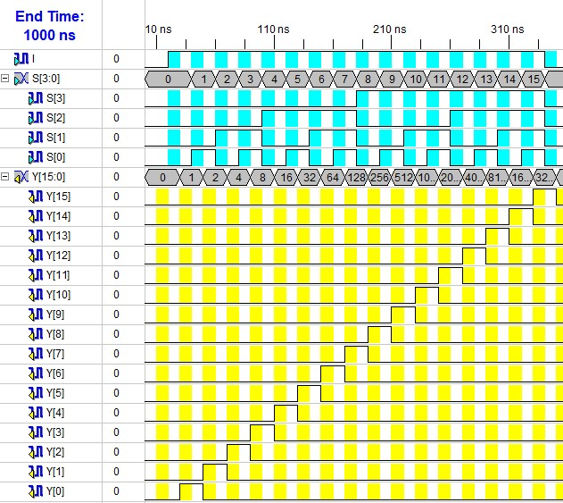

### 9. Encoder & Decoder
Create a 8 to 3 Encoder and a 3 to 8 Decoder using VHDL module(s) in Xilinx.

The Xilinx project can be found [here](/Projects/EncoderDecoder/).

#### Theory

##### Encoder
An encoder is used to convert a decimal number into binary bits. A generic encoder is of the form $2^n$ to $n$, which means it can convert numbers from $0$ to $2^n-1$ to $2^n$ $n$ bit numbers.

For example an $8$ to $3$ encoder encodes numbers from $0-7$ to binary numbers each having $3$ bits. The truth table for the following is - 

| Decimal   |$I_0$|$I_1$|$I_2$|$I_3$|$I_4$|$I_5$|$I_6$|$I_7$|$O_2$|$O_1$|$O_0$|
|  :-:| :-: | :-: | :-: | :-: | :-: | :-: | :-: | :-: | :-: | :-: | :-: |
|	    0	|  1  |  0  |  0  |  0  |  0  |  0  |  0  |  0  | 0 | 0 | 0 |    
|	    1	|  0  |  1  |  0  |  0  |  0  |  0  |  0  |  0  | 0 | 0 | 1 |    
|	    2	|  0  |  0  |  1  |  0  |  0  |  0  |  0  |  0  | 0 | 1 | 0 |    
|	    3	|  0  |  0  |  0  |  1  |  0  |  0  |  0  |  0  | 0 | 1 | 1 |    
|	    4	|  0  |  0  |  0  |  0  |  1  |  0  |  0  |  0  | 1 | 0 | 0 |    
|	    5	|  0  |  0  |  0  |  0  |  0  |  1  |  0  |  0  | 1 | 0 | 1 |    
|	    6	|  0  |  0  |  0  |  0  |  0  |  0  |  1  |  0  | 1 | 1 | 0 |    
|	    7	|  0  |  0  |  0  |  0  |  0  |  0  |  0  |  1  | 1 | 1 | 1 |    

The expressions for the outputs can be written as - 
```math
\begin{align*}
O_0 &= I_1 + I_3 + I_5 + I_7 \\
O_1 &= I_2 + I_3 + I_6 + I_7 \\
O_2 &= I_4 + I_5 + I_6 + I_7 \\
\end{align*}
```

##### Decoder 
A decoder is just the opposite of an encoder. A $n$ to $2^n$ bit decoder maps $2^n$ binary numbers (each having $n$ bits) to decimal numbers from $0$ to $2^n-1$.

For example a $3$ to $8$ decoder decodes 3-bit binary numbers to 8 decimal numbers. The truth table is the same as the encoder with the inputs and outputs swapped.

| $I_2$ | $I_1$ |$I_0$| $O_0$|$O_1$|$O_2$|$O_3$|$O_4$|$O_5$|$O_6$|$O_7$| Decimal|
|:-:    |:-:    |:-:  |  :-: | :-: | :-: | :-: | :-: | :-: | :-: | :-: |  :-:   |
| 0     | 0     | 0   |   1  |  0  |  0  |  0  |  0  |  0  |  0  |  0  |   0	|
| 0     | 0     | 1   |   0  |  1  |  0  |  0  |  0  |  0  |  0  |  0  |   1	|
| 0     | 1     | 0   |   0  |  0  |  1  |  0  |  0  |  0  |  0  |  0  |   2	|
| 0     | 1     | 1   |   0  |  0  |  0  |  1  |  0  |  0  |  0  |  0  |   3	|
| 1     | 0     | 0   |   0  |  0  |  0  |  0  |  1  |  0  |  0  |  0  |   4	|
| 1     | 0     | 1   |   0  |  0  |  0  |  0  |  0  |  1  |  0  |  0  |   5	|
| 1     | 1     | 0   |   0  |  0  |  0  |  0  |  0  |  0  |  1  |  0  |   6	|
| 1     | 1     | 1   |   0  |  0  |  0  |  0  |  0  |  0  |  0  |  1  |   7	|

The expressions for the outputs can be written as - 

```math
\begin{align*}
O_0 &= I_2' \cdot I_1' \cdot I_0' \\
O_1 &= I_2' \cdot I_1' \cdot I_0 \\
O_2 &= I_2' \cdot I_1 \cdot I_0' \\
O_3 &= I_2' \cdot I_1 \cdot I_0 \\
O_4 &= I_2 \cdot I_1' \cdot I_0' \\
O_5 &= I_2 \cdot I_1' \cdot I_0 \\
O_6 &= I_2 \cdot I_1 \cdot I_0' \\
O_7 &= I_2 \cdot I_1 \cdot I_0 \\
\end{align*}
```

#### Encoder VHDL Module
```vhdl
library IEEE;
use IEEE.STD_LOGIC_1164.ALL;
entity Encoder8to3 is
    Port ( I : in  STD_LOGIC_VECTOR (7 downto 0);
           O : out  STD_LOGIC_VECTOR (2 downto 0));
end Encoder8to3;

architecture Dataflow of Encoder8to3 is
begin
	O(0) <= I(1) OR I(3) OR I(5) OR I(7);
	O(1) <= I(2) OR I(3) OR I(6) OR I(7);
	O(2) <= I(4) OR I(5) OR I(6) OR I(7);
end Dataflow;
``` 

####  RTL Circuit
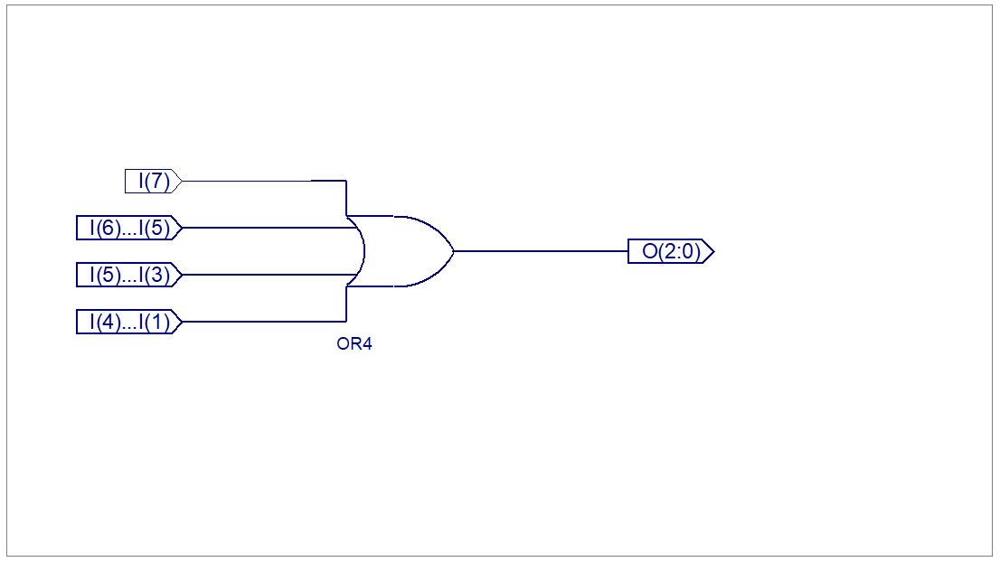

#### Test Bench Waveform
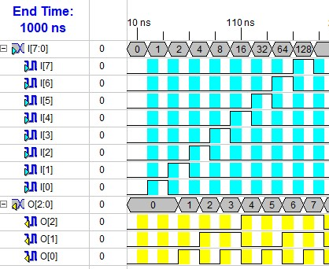

#### Decoder VHDL Module
```vhdl
library IEEE;
use IEEE.STD_LOGIC_1164.ALL;

entity Decoder3to8 is
    Port ( I : in  STD_LOGIC_VECTOR (2 downto 0);
           O : out  STD_LOGIC_VECTOR (7 downto 0));
end Decoder3to8;

architecture Behavioural of Decoder3to8 is
begin
	process(I)
		begin
		O <= "00000000";
			case I is
				when "000" => O(0) <= '1';
				when "001" => O(1) <= '1';
				when "010" => O(2) <= '1';
				when "011" => O(3) <= '1';
				when "100" => O(4) <= '1';
				when "101" => O(5) <= '1';
				when "110" => O(6) <= '1';
				when "111" => O(7) <= '1';
				when others => O   <= "00000000";
			end case;
		end process;
end Behavioural;
```

####  RTL Circuit
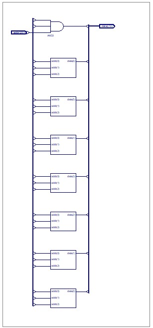

#### Test Bench Waveform
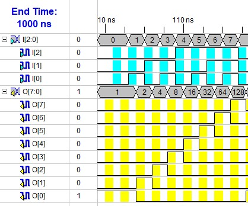

### 10. 2 Bit Comparator 
Create a 2 bit comparator using VHDL module(s) in Xilinx.

The Xilinx project can be found [here](/Projects/Comparator/).

#### Theory 
A 2 bit comparator is used to compare 2 given 2 bit binary numbers. $A$ and $B$ are the 2 binary numbers which are represented as $A_1A_0$ and $B_1B_0$. The comparision outputs are $A>B$, $A=B$ and $A<B$.

|$A_1$|$A_0$|$B_1$|$B_0$|$A<B$|$A=B$|$A>B$|
| :-: | :-: | :-: | :-: | :-: | :-: | :-: |
|  0  |  0  |  0  |  0  |  0  |  1  |  0  |
|  0  |  0  |  0  |  1  |  1  |  0  |  0  |
|  0  |  0  |  1  |  0  |  1  |  0  |  0  |
|  0  |  0  |  1  |  1  |  1  |  0  |  0  |
|  0  |  1  |  0  |  0  |  0  |  0  |  1  |
|  0  |  1  |  0  |  1  |  0  |  1  |  0  |
|  0  |  1  |  1  |  0  |  1  |  0  |  0  |
|  0  |  1  |  1  |  1  |  1  |  0  |  0  |
|  1  |  0  |  0  |  0  |  0  |  0  |  1  |
|  1  |  0  |  0  |  1  |  0  |  0  |  1  |
|  1  |  0  |  1  |  0  |  0  |  1  |  0  |
|  1  |  0  |  1  |  1  |  1  |  0  |  0  |
|  1  |  1  |  0  |  0  |  0  |  0  |  1  |
|  1  |  1  |  0  |  1  |  0  |  0  |  1  |
|  1  |  1  |  1  |  0  |  0  |  0  |  1  |
|  1  |  1  |  1  |  1  |  0  |  1  |  0  |

The outputs can be expressions as - 
```math
\begin{align*}
(A < B) &= \Sigma(1, 2, 3, 6, 7, 11)    \\
(A = B) &= \Sigma(0, 5, 10, 15)         \\
(A > B) &= \Sigma(4, 8, 9, 12, 13, 14)  \\
\end{align*}
```		

Simplying it using K-Maps we get - 
```math
\begin{align*}
(A < B) &= A_1'B_1 + A_1'A_0'B_0 + A_0'B_1B_0   \\
(A > B) &= A_1B_1' + A_1A_0B_0' + A_0B_1'B_0' \\
\\
\text{and } A &= B \text{ can be represented as }\\
& (A < B)' \cdot (A > B)'
\end{align*}
```

#### VHDL Module
```vhdl
library IEEE;
use IEEE.STD_LOGIC_1164.ALL;

entity Comparator2Bit is
    Port ( A : in  STD_LOGIC_VECTOR (1 downto 0);
           B : in  STD_LOGIC_VECTOR (1 downto 0);
           BGREATER : out  STD_LOGIC;
           EQUAL : out  STD_LOGIC;
           AGREATER : out  STD_LOGIC);
end Comparator2Bit;

architecture Behavioral of Comparator2Bit is
SIGNAL O : STD_LOGIC_VECTOR (2 downto 0);
begin
	O(0) <= (NOT(A(1)) AND     B(1))           OR 
			  (NOT(A(1)) AND NOT(A(0)) AND B(0)) OR
			  (NOT(A(0)) AND     B(1)  AND B(0));
					
	O(2) <= (A(1) AND NOT(B(1))) OR
			  (A(1) AND A(0) AND NOT(B(0))) OR
			  (A(0) AND NOT(B(1)) AND NOT(B(0)));
					
	O(1)    <=  NOT(O(0)) AND NOT(O(2));
	
	BGREATER <= O(0);
	EQUAL    <= O(1);
	AGREATER <= O(2);
end Behavioral;
```

####  RTL Circuit
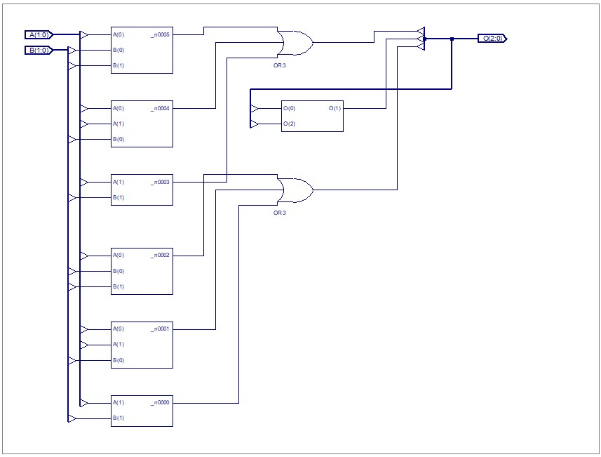

#### Test Bench Waveform
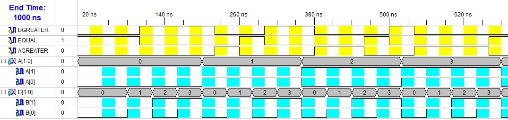

### 11. Ripple Carry Adder 
Create a 4 bit ripple carry adder utilizing 4 full adders using VHDL module(s) in Xilinx.

The Xilinx project can be found [here](/Projects/RippleCarryAdder/).

#### Theory
A ripple carry added is a circuit which is used to add 2 n-bit binary numbers together. It works by propagating or using the carry as a ripple as it goes from the first adder to the next thus the name.

For example the first adder $F.A_0$ takes in the $A_0$, $B_0$ and an optional $C_{in}$ which is often set to 0. So the adder adds the 2 bits and gives the output as the sum $S_0$ and the carry $C_0$. This carry $C_0$ is then passed to the second adder as the 3rd bit. So the second full adder $F.A_1$ takes in $A_1$, $B_1$ and the previous carry which is $C_0$. 

Similarly the $n^{th}$ full adder will take in $A_i$, $B_i$ and $C_{i-1}$ as input. 

#### Full Adder VHDL Module
```vhdl
library IEEE;
use IEEE.STD_LOGIC_1164.ALL;

entity FullAdder is
    Port ( A, B, C : in  STD_LOGIC;
           SUM : out  STD_LOGIC;
           CARRY : out  STD_LOGIC);
end FullAdder;

architecture Dataflow of FullAdder is
begin
	SUM <= A XOR B XOR C;
	CARRY <= (A AND B) OR (B AND C) OR (C AND A);
end Dataflow;
```

#### Ripple Carry Adder VHDL Module
```vhdl
library IEEE;
use IEEE.STD_LOGIC_1164.ALL;

entity RippleCarryAdder is
    Port ( A : in  STD_LOGIC_VECTOR (3 downto 0);
           B : in  STD_LOGIC_VECTOR (3 downto 0);
           SUM : out  STD_LOGIC_VECTOR (3 downto 0);
           CARRY : out  STD_LOGIC);
end RippleCarryAdder;

architecture Structural of RippleCarryAdder is
SIGNAL T : STD_LOGIC_VECTOR(2 downto 0);
begin
	FA0 : entity work.FullAdder Port Map(A => A(0), B => B(0), C =>  '0', SUM => SUM(0), CARRY => T(0));
	FA1 : entity work.FullAdder Port Map(A => A(1), B => B(1), C => T(0), SUM => SUM(1), CARRY => T(1));
	FA2 : entity work.FullAdder Port Map(A => A(2), B => B(2), C => T(1), SUM => SUM(2), CARRY => T(2));
	FA3 : entity work.FullAdder Port Map(A => A(3), B => B(3), C => T(2), SUM => SUM(3), CARRY => CARRY);
end Structural;
```

####  RTL Circuit
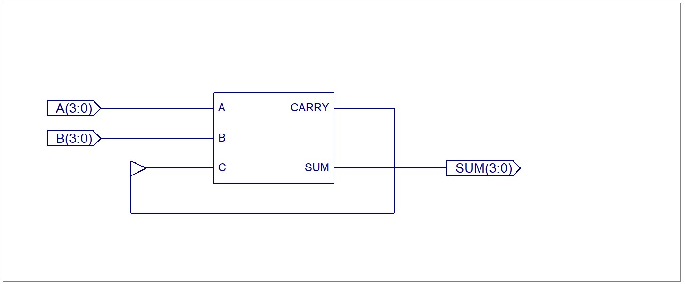

#### Test Bench Waveform
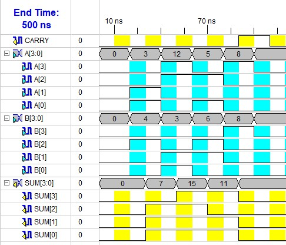

> [!TIP]
> As there will be $2^{8} = 256$ combinations we only have a few select sample outputs

### 12. BCD Adder
Create a BCD Adder utilizing ripple carry adders using VHDL module(s) in Xilinx.

The Xilinx project can be found [here](/Projects/BCDAdder/).

#### Theory
If $A = A_3A_2A_1A_0$ and $B = B_3B_2B_1B_0$. They are added using a ripple carry adder then the output is to be added with $0110$ if it exceeds $9$. 
We can check if it exceeds $9$ if $C$ + $S_3S_2$ + $S_3S_1$ yields a $1$.

So using the Ripple Carry Module we created [earlier](#ripple-carry-adder-vhdl-module).

#### BCD Adder VHDL Module
```vhdl
library IEEE;
use IEEE.STD_LOGIC_1164.ALL;

entity BCDAdder is
    Port ( A : in  STD_LOGIC_VECTOR (3 downto 0);
           B : in  STD_LOGIC_VECTOR (3 downto 0);
           SUM : out  STD_LOGIC_VECTOR (3 downto 0);
           CARRY : out  STD_LOGIC);
end BCDAdder;

architecture Behavioral of BCDAdder is
SIGNAL TSUM   : STD_LOGIC_VECTOR (3 downto 0);
SIGNAL TCARRY : STD_LOGIC;
SIGNAL EXTRA  : STD_LOGIC_VECTOR (3 downto 0);
begin
	RCA0 : entity work.RippleCarryAdder Port Map(A => A(3 downto 0), B => B(3 downto 0), SUM => TSUM, CARRY => TCARRY);
	
	EXTRA(0) <= '0';
	EXTRA(3) <= '0';
	EXTRA(1) <= (TSUM(3) AND TSUM(2)) OR 
					(TSUM(3) AND TSUM(1)) OR
					 TCARRY;
	EXTRA(2) <= EXTRA(1);
	
	RCA1 : entity work.RippleCarryAdder Port Map(A => TSUM(3 downto 0), B => EXTRA(3 downto 0), SUM => SUM);
	CARRY  <= EXTRA(1);
end Behavioral;
```

####  RTL Circuit
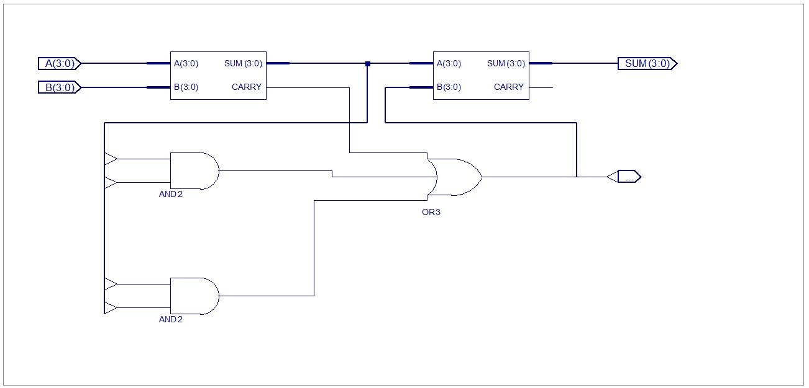

#### Test Bench Waveform
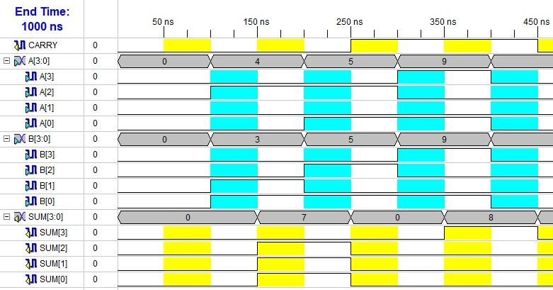

> [!TIP]
> As there will be $2^{8} = 256$ combinations we only have a few select sample outputs