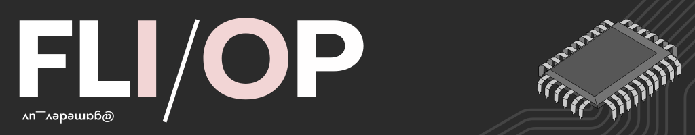

# FlipFlop
Computer Architecture assignments and lab work completed as part of my undergraduate coursework at Sister Nivedita University. 

---

## Experiments
|Sl. No.| Experiment                          | Link|
|:-     | :-:                                 | :-: |
| 1.    | Half and Full Adders                | [Link](#1-half-and-full-adders)   | 
| 2.    | Half and Full Subtractors           | [Link](#2-half-and-full-subtractors)    |
| 3.    | Full Adder using Half Adders        | [Link](#3-full-adder-using-half-adder)    |
| 3.    | Full Subtrator using Half Subtractors        | [Link](#4-full-subtractor-using-half-subtractor)    |
| 4.    | Universal Gates                     | [Link](#5-universal-gates)    |
| 5.    | MUX 4x1                             | [Link](#6-muliplexer)    |

### 1. Half and Full Adders
Create a Xilinx project and create and test a half adder and a full adder. Use VHDL Modules.

The Xilinx project can be found [here](/Projects/simpleAdders).

#### Half Adder
A half adder is a logic circuit that adds two single-bit binary inputs (A and B). It produces two outputs: a Sum bit and a Carry bit.

| A | B | SUM | CARRY |
|:-:|:-:| :-: |  :-:  |
| 0 | 0 |  0  |   0   |
| 0 | 1 |  1  |   0   |
| 1 | 0 |  1  |   0   |
| 1 | 1 |  0  |   1   |

```math
\text{Sum} = A \oplus B\
```

```math
\text{Carry} = A \cdot B
```

#### VHDL Module
```vhdl
library IEEE;
use IEEE.STD_LOGIC_1164.ALL;
use IEEE.STD_LOGIC_ARITH.ALL;
use IEEE.STD_LOGIC_UNSIGNED.ALL;

entity halfAdder is
    Port ( A, B : in  STD_LOGIC;
           SUM : out  STD_LOGIC;
           CARRY : out  STD_LOGIC);
end halfAdder;

architecture Behavioral of halfAdder is
begin
	SUM <= A XOR B;
	CARRY <= A AND B;
end Behavioral;
```
####  RTL Circuit
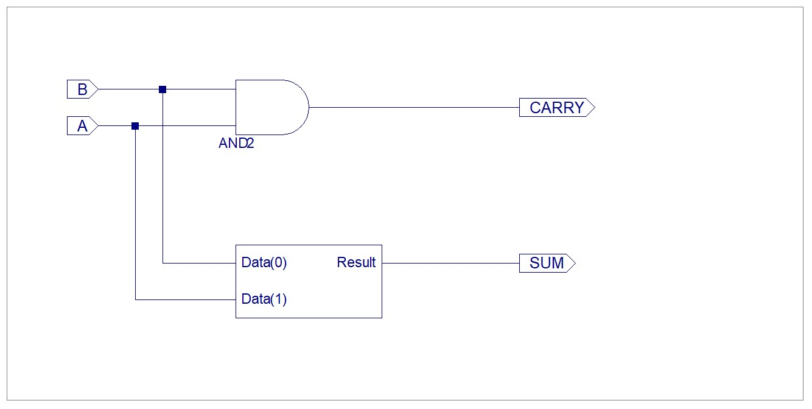

####  Test Bench Output
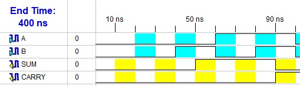

#### Full Adder
A full adder is a logic circuit that adds 3 single-bit binary inputs (A, B, and C). It produces two outputs: a Sum bit and a Carry bit.

| A | B | C | SUM | CARRY |
|:-:|:-:|:-:| :-: |  :-:  |
| 0 | 0 | 0 |  0  |   0   |
| 0 | 0 | 1 |  1  |   0   |
| 0 | 1 | 0 |  1  |   0   |
| 0 | 1 | 1 |  0  |   1   |
| 1 | 0 | 0 |  1  |   0   |
| 1 | 0 | 1 |  0  |   1   |
| 1 | 1 | 0 |  0  |   1   |
| 1 | 1 | 1 |  1  |   1   |

```math
\text{Sum} = A \oplus B \oplus C
```

```math
\text{Carry} = (A \cdot B) + (B \cdot C) + (A \cdot C)
```

#### VHDL Module
```vhdl
library IEEE;
use IEEE.STD_LOGIC_1164.ALL;
use IEEE.STD_LOGIC_ARITH.ALL;
use IEEE.STD_LOGIC_UNSIGNED.ALL;

entity fullAdder is
    Port ( A, B, C : in  STD_LOGIC;
           SUM : out  STD_LOGIC;
           CARRY : out  STD_LOGIC);
end fullAdder;

architecture Behavioral of fullAdder is
begin
	SUM <= A XOR B XOR C;
	CARRY <= (A AND B) OR (B AND C) OR (A AND C); 
end Behavioral;
```
####  RTL Circuit
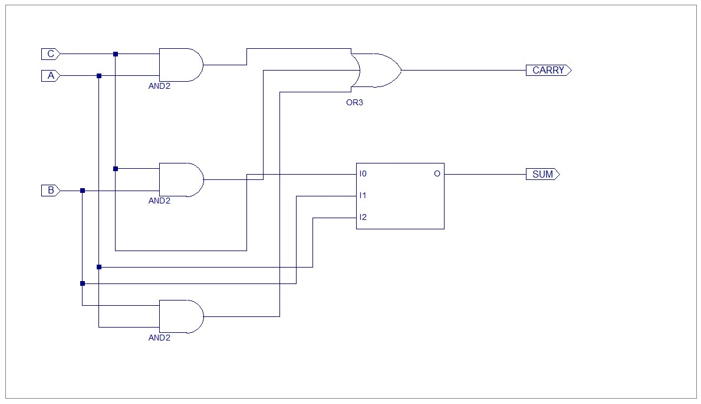

####  Test Bench Output
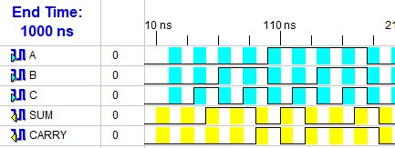

### 2. Half and Full Subtractors
Create a Xilinx project and create and test a half subtractor and a full subtractor. Use VHDL Modules.

The Xilinx project can be found [here](/Projects/simpleSubtractors).

#### Half Subtractor
A half subtractor is a logic circuit that subtracts two single-bit binary inputs (A and B). It produces two outputs: a Difference bit and a Borrow bit.

| A | B | DIFF | BORR  |
|:-:|:-:| :-:  |  :-:  |
| 0 | 0 |  0   |   0   |
| 0 | 1 |  1   |   1   |
| 1 | 0 |  1   |   0   |
| 1 | 1 |  0   |   0   |

```math
\text{Difference} = A \oplus B
```

```math
\text{Borrow} = A' \cdot B
```

#### VHDL Module
```vhdl
library IEEE;
use IEEE.STD_LOGIC_1164.ALL;
use IEEE.STD_LOGIC_ARITH.ALL;
use IEEE.STD_LOGIC_UNSIGNED.ALL;

entity halfSubtractor is
    Port ( A, B : in  STD_LOGIC;
           DIFF : out  STD_LOGIC;
           BORR : out  STD_LOGIC);
end halfSubtractor;

architecture Behavioral of halfSubtractor is
begin
	DIFF <= A XOR B;
	BORR <= ((NOT A) AND B);
end Behavioral;
```
####  RTL Circuit
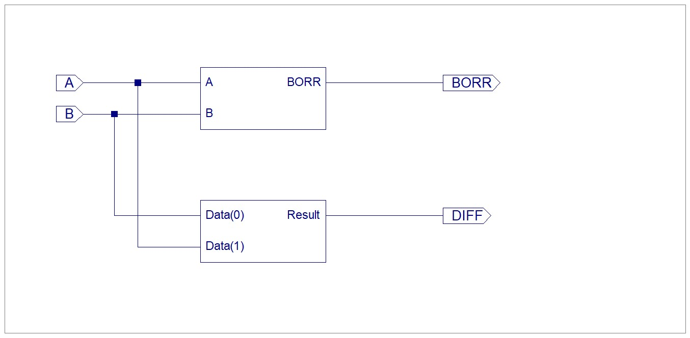

####  Test Bench Output
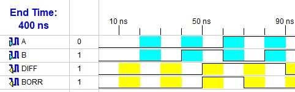

#### Full Subtractor
A full subtractor is a logic circuit that subtracts 3 single-bit binary inputs (A, B, and C). It produces two outputs: a Difference bit and a Borrow bit.

| A | B | C | DIFF | BORR |
|:-:|:-:|:-:| :-:  |  :-:  |
| 0 | 0 | 0 |  0   |   0   |
| 0 | 0 | 1 |  1   |   1   |
| 0 | 1 | 0 |  1   |   1   |
| 0 | 1 | 1 |  0   |   1   |
| 1 | 0 | 0 |  1   |   0   |
| 1 | 0 | 1 |  0   |   0   |
| 1 | 1 | 0 |  0   |   0   |
| 1 | 1 | 1 |  1   |   1   |

```math
\text{Difference} = A \oplus B \oplus C
```

```math
\text{Borrow} = (A' \cdot B) + (B \cdot C) + (A' \cdot C)
```

#### VHDL Module
```vhdl
library IEEE;
use IEEE.STD_LOGIC_1164.ALL;
use IEEE.STD_LOGIC_ARITH.ALL;
use IEEE.STD_LOGIC_UNSIGNED.ALL;

entity fullSubtractor is
    Port ( A, B, C : in  STD_LOGIC;
           DIFF : out  STD_LOGIC;
           BORR : out  STD_LOGIC);
end fullSubtractor;

architecture Behavioral of fullSubtractor is
begin
	DIFF <= A XOR B XOR C;
	BORR <= (NOT(A) AND B) OR (B AND C) OR (NOT(A) AND C); 
end Behavioral;
```
####  RTL Circuit
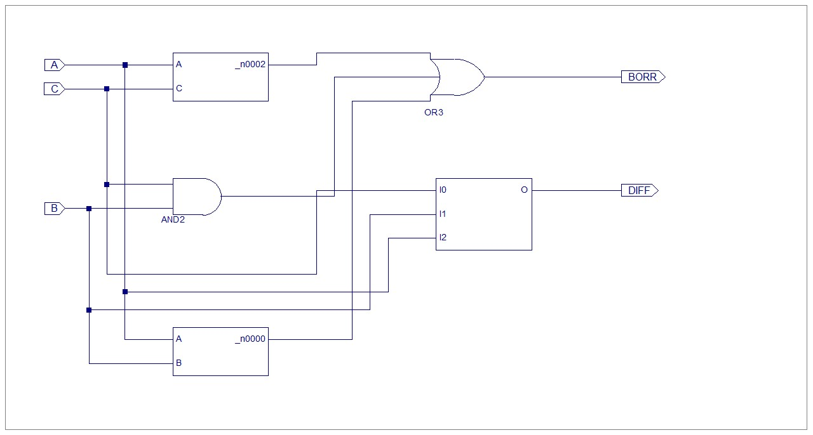

####  Test Bench Output
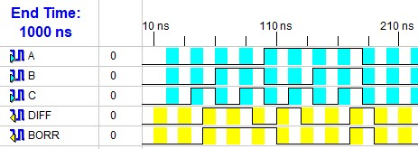

### 3. Full Adder using Half Adder
Create a Xilinx project and create and test a full adder which will be made using 2 half adders.

The Xilinx project can be found [here](/Projects/basicStructural/).

#### Theory 
A full adder can be made by combining 2 half adders. 
We know for a given Half Adder. 

```math
\text{Sum} = A \oplus B
```

```math
\text{Carry} = A \cdot B
```

So if we have the inputs `A`, `B` and `C`.
Then we can pass `A`, `B` to the half adder and get 
```math
S_1 = A \oplus B\newline
C_1 = A \cdot B
```

Then using we can plug the sum of the first half adder and the input C into another half adder. Then we get 
```math
S_2 = S_1 \oplus C\newline
C_2 = S_1 \cdot C\newline
```

```math
\text{Sum} = S_2 = A \oplus B \oplus C\newline
```

The carries we get can be combined using a OR gate
```math
\begin{align*}
\text{Carry} &= C_1 + C_2 \\
&= A \cdot B + S_1 \cdot C \\
&= A \cdot B + (A \oplus B) \cdot C \\
&= A \cdot B + (A'B + AB')\cdot C \\
&= A \cdot B + (A'B + AB')\cdot C \\
&= A \cdot B \cdot (C + C') + (A'B + AB')\cdot C \\
&= ABC + ABC' + A'BC + AB'C
\end{align*}
```

Solving using K-MAP: 
|     | B'C'|  B'C | BC  | BC' | 
| :-: | :-: |  :-: | :-: | :-: |
|  A'  |     |      |  1  |    |
|  A   |     |   1  |  1  |  1 |

```math
\text{Carry} = AB + BC + CA
```

The expressions we get for carry and sum this way match the expressions for a full adder thus 2 half adders can be used in this way to make a full adder.

In Xilinx we can have to do this using Structural Modules. We need a half adder module which we can then make a full adder module. 

#### Half Adder VHDL Module
```vhdl
library IEEE;
use IEEE.STD_LOGIC_1164.ALL;

entity halfAdder is
    Port ( A, B : in  STD_LOGIC;
           SUM, CARRY : out  STD_LOGIC);
end halfAdder;

architecture Behavioral of halfAdder is
begin
	SUM <= A XOR B;
	CARRY <= A AND B;
end Behavioral;
```

> [!NOTE] 
> Then we can create the Full Adder in several ways. 2 ways have been showcased below. 

#### Full Adder VHDL Module (Component Instantiation)
```vhdl
library IEEE;
use IEEE.STD_LOGIC_1164.ALL;

entity fullAdderComponents is
    Port ( A, B, C : in  STD_LOGIC;
           SUM : out  STD_LOGIC;
           CARRY : out  STD_LOGIC);
end fullAdderComponents;

architecture Behavioral of fullAdderComponents is

Component halfAdder
	    Port ( A, B : in  STD_LOGIC;
           SUM, CARRY : out  STD_LOGIC);
end Component;

SIGNAL S1, C1, C2 : STD_LOGIC;
begin
	H1: halfAdder Port Map(A => A, B => B, SUM => S1, CARRY => C1);
	H2: halfAdder Port Map(A => S1, B => C, SUM => SUM, CARRY => C2);
	CARRY <= C1 OR C2;
end Behavioral;
```

#### Full Adder VHDL Module (Direct Entity Instantiation)
```vhdl
library IEEE;
use IEEE.STD_LOGIC_1164.ALL;

entity fullAdderSimplified is
    Port ( A, B, C : in  STD_LOGIC;
           SUM, CARRY : out  STD_LOGIC);
end fullAdderSimplified;

architecture Behavioral of fullAdderSimplified is

SIGNAL S1, C1, C2 : STD_LOGIC;
begin
	H1: entity work.halfAdder Port Map(A => A, B => B, SUM => S1, CARRY => C1);
	H2: entity work.halfAdder Port Map(A => S1, B => C, SUM => SUM, CARRY => C2);
	CARRY <= C1 OR C2;
end Behavioral;
```

> [!TIP]
> When mapping the ports the inputs can be written directly (similar to how methods are called).
> So instead of: 
> ```vhdl
> Port Map(A => A, B => B, SUM => S1, CARRY => C1);
> ```
> We can also just write:
> ```vhdl
> Port Map(A, B, S1, C1);
> ```
> But I prefer writing the name of the ports so it is clear to the reader what is being passed as input, as Xilinx doesn't have any built-in method peek functionality.

####  RTL Circuit
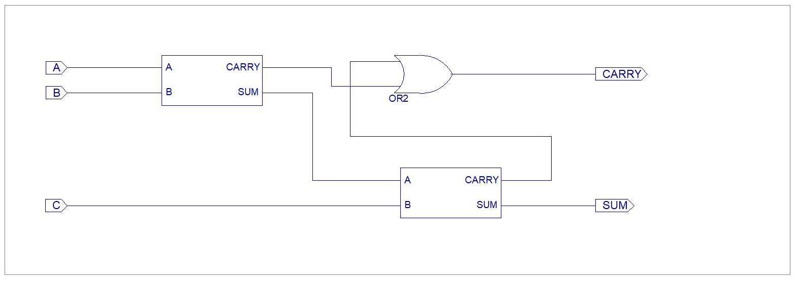

####  Test Bench Output
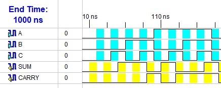

### 4. Full Subtractor using Half Subtractor
Create a Xilinx project and create and test a full subtractor which will be made using 2 half subtractor.

The Xilinx project can be found [here](/Projects/basicStructural/).

We already proved how a full adder can be created with 2 half adders and an OR gate, we can similarly use 2 half subtrators along with an OR gate to create a full subtractor.

#### Full Subtractor VHDL Module (Component Instantiation)
```vhdl
library IEEE;
use IEEE.STD_LOGIC_1164.ALL;

entity fullSubtractorComponents is
    Port ( A, B, C : in  STD_LOGIC;
           DIFF, BORR : out  STD_LOGIC);
end fullSubtractorComponents;

architecture Behavioral of fullSubtractorComponents is

Component halfSubtractor
	    Port ( A, B : in  STD_LOGIC;
           DIFF, BORR : out  STD_LOGIC);
end Component;
SIGNAL D1, B1, B2 : STD_LOGIC;
begin
	HS1 : entity halfSubtractor Port Map(A => A, B => B, DIFF => D1, BORR => B1);
	HS2 : entity halfSubtractor Port Map(A => D1, B => C, DIFF => DIFF, BORR => B2);
	BORR <= B1 OR B2;
end Behavioral;
```

#### Full Subtractor VHDL Module (Direct Entity Instantiation)
```vhdl
library IEEE;
use IEEE.STD_LOGIC_1164.ALL;

entity fulllSubtractorSimplified is
    Port ( A, B, C : in  STD_LOGIC;
           DIFF, BORR : out  STD_LOGIC);
end fulllSubtractorSimplified;

architecture Behavioral of fulllSubtractorSimplified is
SIGNAL D1, B1, B2 : STD_LOGIC;
begin
	HS1 : entity work.halfSubtractor Port Map(A => A, B => B, DIFF => D1, BORR => B1);
	HS2 : entity work.halfSubtractor Port Map(A => D1, B => C, DIFF => DIFF, BORR => B2);
	BORR <= B1 OR B2;
end Behavioral; 
```
#### RTL Circuit
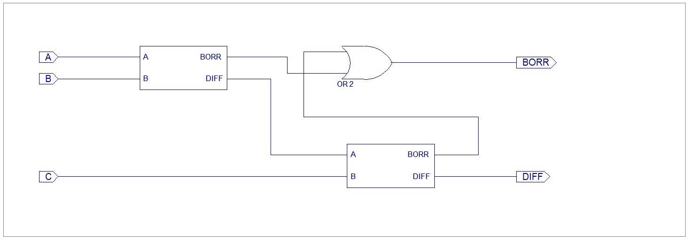

#### Test Bench Output
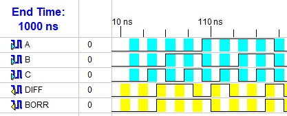

> [!NOTE]
> Even though both methods have been showcased here, I'll be using Direct Entity Instantiation from now on.

### 5. Universal Gates
Create the AND and OR gates using only the universal gates (NOR, NAND). Use VHDL modules in Xilinx. 
The project can be found [here](/Projects/universalGates/).

#### Universal Gates
The NAND and NOR gates are often called the Universal gates as they can be used to recreate all the other gates. 

The NAND gate is the negation of the output of a NAND gate.
| A | B | AND | NAND |
|:-:|:-:| :-: |  :-: |
| 0 | 0 |  0  |   1  |
| 0 | 1 |  0  |   1  |
| 1 | 0 |  0  |   1  |
| 1 | 1 |  1  |   0  |

```math
A \text{ NAND } B = (A \cdot B)' = A' + B'
```

The NOR gate is the negation of the output of a OR gate.
| A | B | OR  |  NOR |
|:-:|:-:| :-: |  :-: |
| 0 | 0 |  0  |   1  |
| 0 | 1 |  1  |   0  |
| 1 | 0 |  1  |   0  |
| 1 | 1 |  1  |   0  |

```math
A \text{ NOR } B = (A + B)' = A' \cdot B'
```

#### NOT using NAND VHDL Module
```vhdl
library IEEE;
use IEEE.STD_LOGIC_1164.ALL;

entity notUsingNand is
    Port ( A : in  STD_LOGIC;
           ANOT : out  STD_LOGIC);
end notUsingNand;

architecture Behavioral of notUsingNand is
begin
		NAND1: entity work.nandGate Port Map(A => A, B => A, Z => ANOT);
end Behavioral;
```

$$
\begin{aligned}
ANOT &= (A \cdot A)' = (A)' = A'
\end{aligned}
$$

#### NOT using NOR VHDL Module
```vhdl
library IEEE;
use IEEE.STD_LOGIC_1164.ALL;

entity notUsingNor is
    Port ( A : in  STD_LOGIC;
           ANOT : out  STD_LOGIC);
end notUsingNor;

architecture Behavioral of notUsingNor is
begin
	NOR1 : entity work.norGate Port Map(A => A, B => A, Z => ANOT);
end Behavioral;
```

$$
\begin{aligned}
ANOT &= (A + A)' = (A)' = A'
\end{aligned}
$$

#### AND using NAND VHDL Module
```vhdl
library IEEE;
use IEEE.STD_LOGIC_1164.ALL;

entity andUsingNand is
    Port ( A, B : in  STD_LOGIC;
           Z : out  STD_LOGIC);
end andUsingNand;

architecture Behavioral of andUsingNand is
SIGNAL O_1 : STD_LOGIC;
begin
	NAND1 : entity work.nandGate Port Map(A => A, B => B, Z => O_1);
	NAND2 : entity work.nandGate Port Map(A => O_1, B => O_1, Z => Z); 
end Behavioral;
```
$$
\begin{aligned}
O_1 &= (A \cdot B)' \\
Z &= (O_1 \cdot O_1)' = (O_1)' = ((A \cdot B)')' = A \cdot B
\end{aligned}
$$

#### AND using NOR VHDL Module
```vhdl
library IEEE;
use IEEE.STD_LOGIC_1164.ALL;

entity andUsingNor is
    Port ( A, B : in  STD_LOGIC;
           Z : out  STD_LOGIC);
end andUsingNor;

architecture Behavioral of andUsingNor is
SIGNAL notA, notB : STD_LOGIC;
begin
	NOR1 : entity work.norGate Port Map(A => A, B => A, Z => notA);
	NOR2 : entity work.norGate Port Map(A => B, B => B, Z => notB);
	NOR3 : entity work.norGate Port Map(A => notA, B => notB, Z => Z);
end Behavioral;
```

$$
Z = (A' + B')' = A'' \cdot B'' = A \cdot B
$$

#### OR using NAND VHDL Module
```vhdl
library IEEE;
use IEEE.STD_LOGIC_1164.ALL;

entity orUsingNand is
    Port ( A, B : in  STD_LOGIC;
           Z : out  STD_LOGIC);
end orUsingNand;

architecture Behavioral of orUsingNand is
SIGNAL notA, notB, STD_LOGIC;
begin
	NAND1: entity work.nandGate Port Map(A => A, B => A, Z => notA);
	NAND2: entity work.nandGate Port Map(A => B, B => B, Z => notB);
	NAND3: entity work.nandGate Port Map(A => notA, B => notB, Z => Z);
end Behavioral;
```

$$
Z = (A' \cdot B')' = A'' + B'' = A + B
$$

#### OR using NOR VHDL Module
```vhdl
library IEEE;
use IEEE.STD_LOGIC_1164.ALL;

entity orUsingNor is
    Port ( A, B : in  STD_LOGIC;
           Z : out  STD_LOGIC);
end orUsingNor;

architecture Behavioral of orUsingNor is
SIGNAL O_1 : STD_LOGIC;
begin
	NOR1 : entity work.norGate Port Map(A => A, B => B, Z => O_1);
	NOR2 : entity work.norGate Port Map(A => O_1, B => O_1, Z => Z);
end Behavioral;
```
$$
\begin{aligned}
O_1 &= (A + B)' \\
Z &= (O_1 + O_1)' = (O_1)' = ((A + B)')' = A + B
\end{aligned}
$$

### 6. Muliplexer
Create a 4x1 MUX using VHDL modules in Xilinx. 
The project can be found [here](/Projects/Multiplixer4x1/).

#### Multiplexer (MUX)
A multiplexer is used to select between $2^n$ given inputs by utilizing $n$ selection line inputs.

A general MUX is defined as a $2^n$x1. So a 4x1 MUX has 2 selection line inputs and can be used to select between 4 input values, let's call them $I_0$, $I_1$, $I_2$ and $I_3$ respectively. And the selection line inputs are labelled as $S_0$ and $S_1$.

We can form a truth table which looks like this -
| $S_1$ | $S_0$ | Output |
|   :-: | :-:   | :-:    |
|   0   | 0     | $I_0$  |
|   0   | 1     | $I_1$  |
|   1   | 0     | $I_2$  |
|   1   | 1     | $I_3$  |

So the output can be represented as -
```math
\begin{align*}
\text{Y} &= S_0' \cdot S_1' \cdot I_0\\
         &+ S_0' \cdot S_1 \cdot I_1\\
         &+ S_0 \cdot S_1' \cdot I_2\\
         &+ S_0 \cdot S_1 \cdot I_3\\
\end{align*}
```

There are several ways to represent this within VHDL. Some of the ways have been showcased below.

#### VDHL Modules 
##### Using basic operations
```vhdl
library IEEE;
use IEEE.STD_LOGIC_1164.ALL;

entity mux4x1 is
    Port ( I : in  STD_LOGIC_VECTOR (03 downto 0);
           S : in  STD_LOGIC_VECTOR (01 downto 0);
           Y : out  STD_LOGIC);
end mux4x1;

architecture Behavioral of mux4x1 is
begin
	Y <= ((I(0) AND (NOT S(1)) AND (NOT S(0))) OR
		   (I(1) AND (NOT S(1)) AND (    S(0))) OR
		   (I(2) AND (    S(1)) AND (NOT S(0))) OR
		   (I(3) AND (    S(1)) AND (    S(0))));
end Behavioral;
```

##### Using select statement

```vhdl
library IEEE;
use IEEE.STD_LOGIC_1164.ALL;

entity mux4x1usingSelect is
    Port ( I : in  STD_LOGIC_VECTOR (3 downto 0);
           S : in  STD_LOGIC_VECTOR (1 downto 0);
           Y : out  STD_LOGIC);
end mux4x1usingSelect;

architecture Behavioral of mux4x1usingSelect is
begin
	with S select
		Y <= I(0) when "00",
			  I(1) when "01",
			  I(2) when "10",
			  I(3) when "11",
			  '0'  when others;
end Behavioral;
```

##### Using case statements
```vhdl
library IEEE;
use IEEE.STD_LOGIC_1164.ALL;

entity mux4x1UsingCase is
    Port ( I : in  STD_LOGIC_VECTOR (3 downto 0);
           S : in  STD_LOGIC_VECTOR (1 downto 0);
           Y : out  STD_LOGIC);
end mux4x1UsingCase;

architecture Behavioral of mux4x1UsingCase is
begin
	process(I, S)
		begin
		
			case S is 
				when "00" =>
					Y <= I(0);
				when "01" => 
					Y <= I(1);
				when "10" => 
					Y <= I(2);
				when "11" =>
					Y <= I(3);
				when others => 
					Y <= '0';
					
			end case;
			
		end process;
end Behavioral;
```

##### Using conditional statements
```vhdl
library IEEE;
use IEEE.STD_LOGIC_1164.ALL;

entity mux4x1UsingConditional is
    Port ( I : in  STD_LOGIC_VECTOR (3 downto 0);
           S : in  STD_LOGIC_VECTOR (1 downto 0);
           Y : out  STD_LOGIC);
end mux4x1UsingConditional;

architecture Behavioral of mux4x1UsingConditional is
begin
	process(I, S)
		begin
			if S = "00" then
				Y <= I(0);
			elsif S = "01" then
				Y <= I(1);
			elsif S = "10" then 
				Y <= I(2);
			elsif S = "11" then 
				Y <= I(3);
			else
				Y <= '0';
			end if;
		end process;
end Behavioral;
```

> [!NOTE]
> As conditional statements and case statements are executed sequentially unlike they must be enclosed within a `process`.